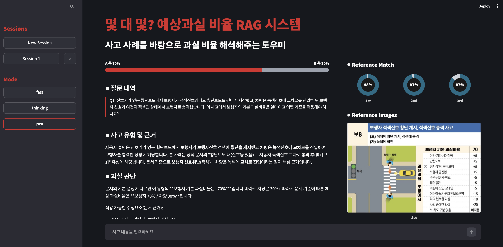
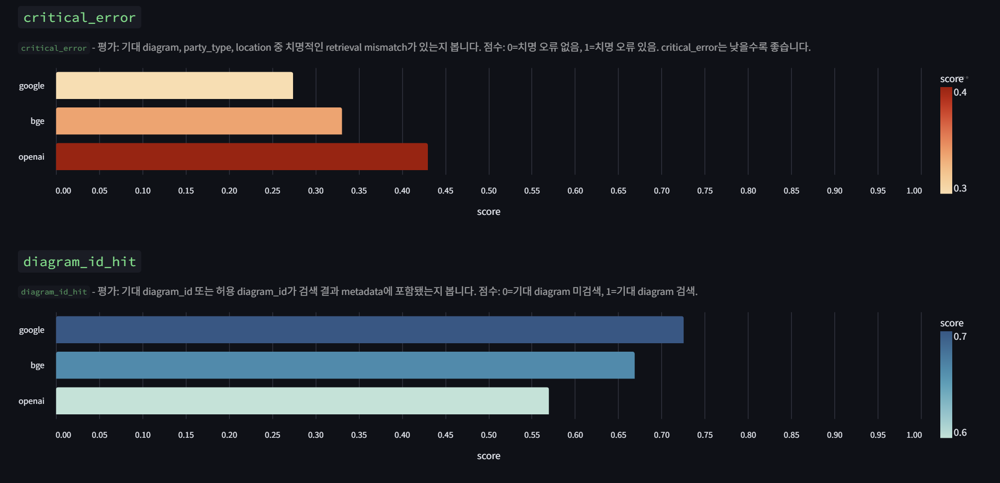
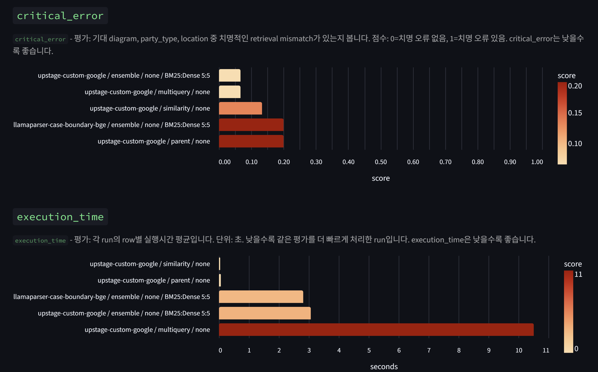
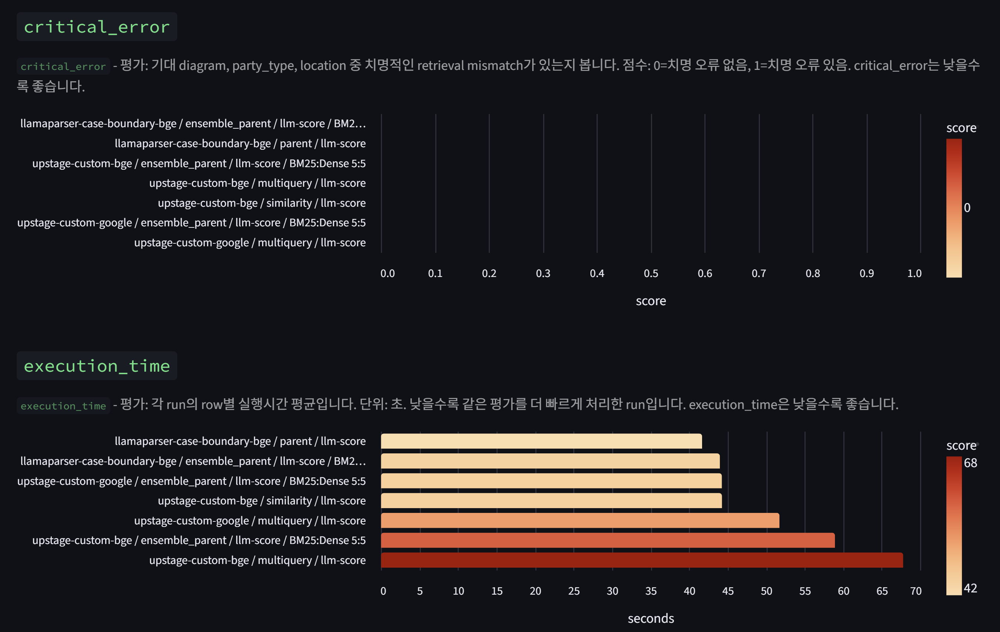
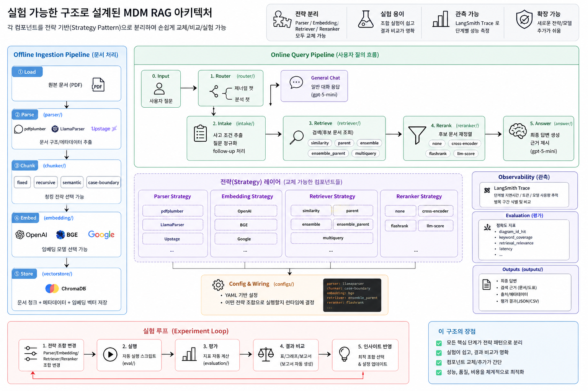
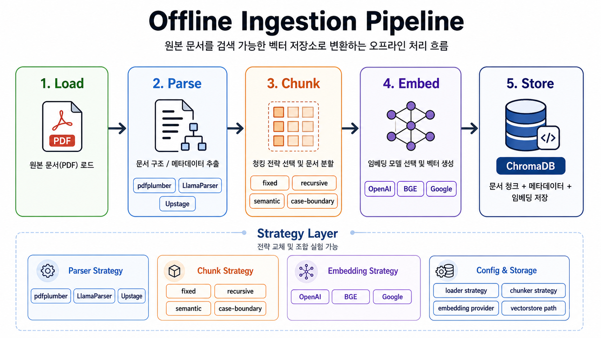
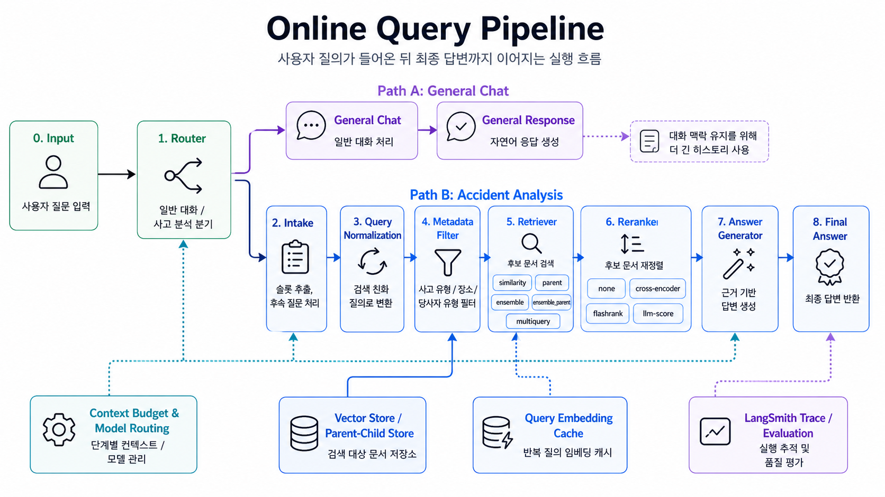
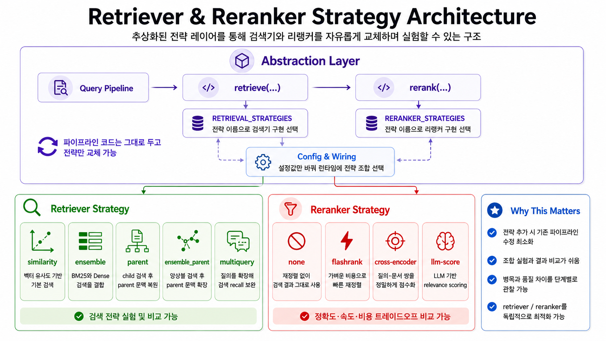

# 1. 서비스 소개



## 1) MDM이란?

`MDM(몇대몇)`은 **자동차 사고 과실비율 인정 기준 PDF**를 기반으로 사고 상황을 분석하고, 관련 기준 문서의 근거를 함께 제시하는 `RAG 기반 사고 과실 분석 서비스`입니다.

사용자는 사고 상황을 자연어로 입력할 수 있습니다. 시스템은 입력이 부족하면 추가 질문을 통해 사고 정보를 보강하고, 문서 검색과 재순위화 과정을 거쳐 관련 과실 기준을 찾아 답변합니다. 단순 질의응답을 넘어, 사고 유형 후보·근거 문서·참고 이미지·검색 결과를 함께 보여주어 사용자가 판단 근거를 확인할 수 있도록 설계했습니다.

### `MDM` 핵심 가치

- *Grounded Answer* : 자동차 사고 과실비율 인정 기준 문서에 기반한 답변 생성
- *Better Intake* : 사고 상황이 모호할 때 추가 질문과 질의 정규화로 검색 품질 개선
- *Comparable RAG* : Parser, Chunker, Retriever, Reranker 조합을 평가하고 비교 가능한 구조
- *Traceable Result* : LangSmith 추적과 로컬 대시보드로 검색·판단 품질을 검증

## 2) 개발 기간

- 2026-04-23 ~ 2026-05-05

## 3) 산출물 모아보기


**평가 및 대시보드**

- [Evaluation Dashboard README](evaluation/dashboard/README.md)
- Retrieval 평가 스크립트: [evaluation/evaluate_retrieval_langsmith.py](evaluation/evaluate_retrieval_langsmith.py)
- Decision 평가 스크립트: [evaluation/evaluate_decision_suites.py](evaluation/evaluate_decision_suites.py)
- 평가 결과: `evaluation/results/`

**데이터**

- 기준 문서: `data/raw/230630_자동차사고 과실비율 인정기준_최종.pdf`
- 테스트셋: `data/testsets/`
- 문서 이미지: `data/images/`
- 파싱/청킹 캐시: `data/llama_md/`, `data/upstage_output/`, `data/chunks/`

## 4) 팀 소개

- 김시안
  - Upstage 기반 문서 전처리 및 파싱, 청킹 구현
  - Streamlit 기반 사용자 화면 개선
  - 과실 분석 화면 재설계 및 참고 문서 매칭 표시 개선
  - 모드 프리셋, 참고 문서 랭킹, 검색 결과 UI 개선
  - Ensemble/Parent Retrieval 제어 UI 구현
  - 팀 프로젝트 발표자 역할

- 이은성
  - 멀티턴 RAG 및 Intake 파이프라인 구현
  - 사고 질의 정규화, 검색 슬롯 추출, 추가 질문 로직 개선
  - 메타데이터 필터링, fallback 검색, Reranker 전략 개선
  - LLM 모델 분리, Redis 세션 저장소, SQLite 쿼리 임베딩 캐시 구현

- 조준용
  - PDF 파싱·문서 로더·청킹 파이프라인 구현
  - LlamaParse, pdfplumber 기반 문서 전처리 전략 구축
  - Fixed, Recursive, Markdown, Case-boundary, Semantic Chunker 구현
  - 페이지 메타데이터 생성, Chunk Cache, Vectorstore 경로 및 임베딩 Provider 전략 구현
  - LangSmith 기반 Retrieval/Decision 평가 체계 구축
  - 평가 매트릭스 확장, 로컬 평가 병렬화, 평가 결과 산출물 관리
  - 평가 대시보드 모듈화 및 결과 비교 화면 개선
  - Parser/Chunker/Embedder/Retriever/Reranker 조합 비교 기능 구현

- 공통
  - 테스트셋 구축 및 평가 데이터 정리
  - README 및 실험 문서 보완
  - 리뷰 피드백 반영, 버그 수정, 품질 안정화

## 5) 기능 소개

### (1) 사고 상황 Intake

**부족한 사고 정보를 먼저 정리**

사용자가 사고 상황을 입력하면 Intake 단계에서 사고 장소, 진행 방향, 차선, 충돌 상황 등 검색에 필요한 정보를 구조화합니다. 입력이 부족하거나 모호하면 추가 질문을 생성하고, 검색에 적합한 형태로 질의를 정규화합니다.

### (2) 문서 기반 과실 분석

**기준 문서에 근거한 답변 생성**

자동차 사고 과실비율 인정 기준 PDF에서 관련 사고 유형과 문서 조각을 검색한 뒤, LLM이 검색된 근거만을 바탕으로 답변합니다. 답변에는 사고 유형 후보, 판단 근거, 참고 문서가 함께 표시됩니다.

### (3) 다양한 검색 전략

**실험 가능한 RAG 파이프라인**

Parser, Chunker, Embedding Provider, Retriever, Reranker를 분리해 조합별 실험이 가능합니다.

- Loader: `pdfplumber`, `llamaparser`, `upstage`
- Chunker: `fixed`, `recursive`, `markdown`, `case-boundary`, `semantic`, `custom`
- Embedding: `OpenAI`, `Google`, `BGE`
- Retriever: dense, parent, ensemble, ensemble parent
- Reranker: none, cross-encoder, flashrank, LLM score

### (4) Streamlit 분석 UI

**채팅형 사고 분석과 검색 결과 확인**

Streamlit UI에서 세션을 생성하고 사고 상황을 입력할 수 있습니다. 사이드바에서는 `fast`, `thinking`, `pro` 모드 프리셋을 선택하고, Loader/Chunker/Retriever/Reranker 설정을 조정할 수 있습니다. 분석 결과 화면에서는 과실 비율, 참고 근거, 검색 문서, 관련 이미지를 확인할 수 있습니다.

### (5) 평가 대시보드

**RAG 조합별 품질 비교**

LangSmith 평가 결과와 로컬 CSV/JSON 산출물을 기반으로 조합별 성능을 비교합니다. 검색 적중률, 문서 관련성, 키워드 커버리지, 실패 케이스, 실행 시간 등을 확인해 어떤 파이프라인 구성이 더 안정적인지 판단할 수 있습니다.

## 6) 프리셋 결정 실험

Streamlit UI의 `fast`, `thinking`, `pro` 모드는 평가 결과를 기준으로 정했습니다. 핵심 지표는 `critical_error`와 `execution_time`입니다. `critical_error`는 기대한 `diagram`, `party_type`, `location` 중 치명적인 retrieval mismatch가 있는지 보는 지표이며 낮을수록 좋습니다. `execution_time`은 row별 평균 실행 시간이며 낮을수록 빠릅니다.

### (1) Embedding Provider 비교



동일 조건에서 `google`, `bge`, `openai` 임베딩을 비교했을 때 `Google embedding`이 가장 낮은 `critical_error`와 가장 높은 `diagram_id_hit`을 보였습니다. 이후 프리셋은 임베딩 차이로 인한 변수를 줄이고 검색기·리랭커 조합을 공정하게 비교하기 위해 `upstage-custom-google` 조합으로 통일했습니다.

### (2) Reranker none 기준 비교



리랭커를 사용하지 않는 `none` 기준에서는 `upstage-custom-google / ensemble / none` 조합이 가장 낮은 `critical_error`를 보였습니다. 다만 `parent / none`은 약간 더 높은 오류를 감수하는 대신 실행 시간이 매우 짧아 실시간 응답용 후보로 유지했습니다.

- `upstage-custom-google / ensemble / none`: `critical_error 0.06`, `execution_time 3 sec`
- `upstage-custom-google / parent / none`: `critical_error 0.2`, `execution_time 0.06 sec`

### (3) LLM Score 기준 비교



`llm-score` 기준에서는 `llamaparser / bge / parent` 또는 `ensemble_parent`도 좋은 결과를 보였지만, 최종 프리셋에서는 임베딩을 Google로 통일하는 B안을 선택했습니다. 이 기준에서 `upstage-custom-google / ensemble_parent / llm-score`는 `critical_error 0`을 달성했고, 실행 시간은 약 `44.2 sec`로 가장 느리지만 품질 우선 모드에 적합했습니다.

### (4) Cross Encoder 기준 비교

`cross-encoder` 기준에서는 `upstage / google / ensemble_parent / cross-encoder` 조합이 안정적인 품질과 중간 수준의 실행 시간을 보였습니다. `critical_error 0.2`, `execution_time 24.4 sec`로 `llm-score`보다 빠르고 `none`보다 정교한 재정렬을 제공해 균형형 모드로 선택했습니다.

### 최종 프리셋

| 모드 | 선택 조합 | 결정 기준 |
|---|---|---|
| `Fast` | `upstage-custom-google / parent / none` | 가장 빠른 응답. `critical_error 0.2`, `execution_time 0.06 sec` |
| `Fast` | `upstage-custom-google / ensemble / none` | 리랭커 없이 가장 낮은 오류. `critical_error 0.06`, `execution_time 3 sec` |
| `Thinking` | `upstage-custom-google / ensemble_parent / cross-encoder` | 품질과 속도의 균형. `critical_error 0.2`, `execution_time 24.4 sec` |
| `Pro` | `upstage-custom-google / ensemble_parent / llm-score` | 품질 최우선. `critical_error 0`, `execution_time 44.2 sec` |

정리하면, `Fast`는 리랭킹 비용을 제거해 응답 속도를 우선하고, `Thinking`은 cross-encoder로 문서 순위를 보정해 속도와 품질을 절충합니다. `Pro`는 LLM 기반 재평가를 사용해 실행 시간은 길지만 치명 오류를 최소화하는 품질 우선 모드입니다.

## 7) 기술 스택

**Language & Runtime**

- Python 3.11+
- uv

**RAG / LLM**

- LangChain
- LangSmith
- OpenAI
- Upstage
- LlamaParse
- BGE Embedding
- Cross Encoder / Flashrank / LLM Score Reranker

**Vectorstore & Cache**

- Chroma
- Redis
- SQLite Query Embedding Cache

**Parsing & Data**

- pdfplumber
- PyMuPDF
- LlamaParse
- Upstage Document Parse

**UI**

- Streamlit

# 2. 설계

## 1) 아키텍처



MDM은 문서 처리와 사용자 질의 처리를 분리한 RAG 구조입니다. 오프라인에서는 기준 PDF를 파싱, 청킹, 임베딩해 Vectorstore에 저장하고, 온라인에서는 사용자 입력을 Router와 Intake로 정리한 뒤 Retriever와 Reranker를 거쳐 근거 기반 답변을 생성합니다. Parser, Chunker, Embedding, Retriever, Reranker를 전략 레이어로 분리해 조합별 실험과 품질 비교가 가능하도록 설계했습니다.

```text
사용자 입력
   ↓
Intake / Router
   ↓
질의 정규화 및 검색 슬롯 추출
   ↓
Loader → Chunker → Embedding → Vectorstore
   ↓
Retriever → Reranker
   ↓
LLM Answer Generation
   ↓
Streamlit UI / LangSmith Trace / Evaluation Dashboard
```

### 오프라인 문서 처리 흐름



기준 PDF를 로드한 뒤 `pdfplumber`, `LlamaParse`, `Upstage` 중 선택한 파서로 문서 구조와 메타데이터를 추출합니다. 이후 청킹 전략을 적용하고 임베딩을 생성해 ChromaDB에 저장합니다. 이 단계에서 생성된 청크, 메타데이터, 임베딩은 온라인 검색의 기준 데이터로 사용됩니다.

### 온라인 질의 처리 흐름



사용자 입력은 Router를 통해 일반 대화와 사고 분석 경로로 나뉩니다. 사고 분석 경로에서는 Intake, 질의 정규화, 메타데이터 필터링, 검색, 재순위화, 답변 생성을 순서대로 수행하며, LangSmith Trace와 평가 결과를 통해 단계별 품질을 확인합니다.

### Retriever & Reranker 전략 구조



검색기와 리랭커는 공통 인터페이스와 설정 기반 wiring으로 분리되어 있습니다. 따라서 기존 파이프라인을 크게 수정하지 않고 `similarity`, `parent`, `ensemble_parent`, `multiquery` 같은 검색 전략과 `none`, `flashrank`, `cross-encoder`, `llm-score` 같은 재순위화 전략을 교체하며 정확도, 속도, 비용의 trade-off를 비교할 수 있습니다.

## 2) 주요 모듈

- [main.py](main.py): Streamlit 채팅 UI 진입점
- [config.py](config.py): 기본 모델, 경로, Retriever/Reranker 설정 관리
- [rag/loader/](rag/loader): PDF 파서별 문서 로더 전략
- [rag/chunkers/](rag/chunkers): 청킹 전략 구현
- [rag/embeddings/](rag/embeddings): 임베딩 Provider 및 쿼리 캐시
- [rag/pipeline/retriever/](rag/pipeline/retriever): 검색 전략 구현
- [rag/pipeline/reranker/](rag/pipeline/reranker): 검색 후보 재순위화
- [rag/service/intake/](rag/service/intake): 사고 정보 수집, 정규화, 추가 질문
- [rag/service/conversation/](rag/service/conversation): 대화 흐름 및 라우팅
- [rag/service/analysis/](rag/service/analysis): 검색 기반 사고 분석 및 답변 생성
- [evaluation/](evaluation): Retrieval/Decision 평가와 대시보드

## 3) 데이터 흐름

1. 기준 PDF를 Parser 전략에 따라 문서로 변환합니다.
2. 문서를 Chunker 전략에 따라 검색 가능한 단위로 나눕니다.
3. 청크를 임베딩해 Vectorstore에 저장합니다.
4. 사용자의 사고 설명을 Intake 단계에서 구조화하고 검색 질의로 정규화합니다.
5. Retriever가 후보 문서를 찾고 Reranker가 최종 근거 문서를 선별합니다.
6. LLM이 근거 문서 기반으로 과실 분석 답변을 생성합니다.
7. 결과는 Streamlit UI에 표시되고 LangSmith 및 로컬 평가 결과로 검증됩니다.

# 3. 설치 및 사용법

## 1) 환경 설정

```bash
git clone https://github.com/hk-llm-middle-project/MDM.git
cd MDM
uv sync
cp .env.example .env
```

`.env`에는 사용하는 Provider에 맞게 API Key를 설정합니다.

```text
OPENAI_API_KEY=
LANGSMITH_API_KEY=
LLAMA_CLOUD_API_KEY=
GOOGLE_API_KEY=
BGE_API_KEY=
BGE_BASE_URL=
```

## 2) Redis 실행

멀티턴 세션 저장을 Redis로 사용할 경우 아래 명령어로 실행합니다.

```bash
docker compose up -d redis
```

메모리 기반 세션 저장소만 사용할 경우 `.env`에서 `SESSION_STORE_BACKEND=memory`로 설정하면 됩니다.

## 3) Streamlit 앱 실행

```bash
uv run streamlit run main.py
```

## 4) 평가 실행

Retrieval 평가:

```bash
uv run python evaluation/evaluate_retrieval_langsmith.py --preset all
```

Decision 평가:

```bash
uv run python evaluation/evaluate_decision_suites.py --suite all
```

평가 대시보드:

```bash
uv run streamlit run evaluation/dashboard/app.py
```

# 4. 협업

## 1) Git 브랜치

- `master`: 기본 브랜치
- `dev`: 통합 개발 브랜치
- `dev-lee`: Intake, 대화 흐름, RAG 서비스, 캐시 및 세션 관리
- `dev-cho`: 문서 파싱, 청킹, 임베딩, 평가 및 대시보드
- `dev-ann`: Streamlit UI/UX 및 검색 결과 표시 개선

## 2) Commit 메시지

```text
type: summary
```

사용한 주요 타입:

- `feat`: 기능 추가
- `fix`: 버그 수정
- `docs`: 문서 수정
- `refactor`: 구조 개선
- `test`: 테스트 추가/수정
- `chore`: 설정, 의존성, 산출물 정리


## 3) 품질 관리

- LangSmith Trace로 질의별 검색·답변 흐름을 추적합니다.
- Retrieval/Decision 평가 스크립트로 파이프라인 조합별 품질을 비교합니다.
- 평가 결과는 `evaluation/results/`에 CSV와 summary JSON으로 저장합니다.
- Streamlit 대시보드에서 실패 케이스와 지표를 확인하며 개선합니다.
