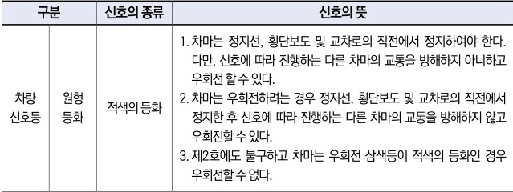

자동차사고 과실비율 인정기준 | 제3편 사고유형별 과실비율 적용기준 041

| 구분     | 신호의 종류 | 신호의 뜻  |                                                                                         |                                                                                        |                                                  |
| ------ | ------ | ------ | --------------------------------------------------------------------------------------- | -------------------------------------------------------------------------------------- | ------------------------------------------------ |
| 차량 신호등 | 원형 등화  | 적색의 등화 | 1. 차마는 정지선, 횡단보도 및 교차로의 직전에서 정지하여야 한다. 다만, 신호에 따라 진행하는 다른 차마의 교통을 방해하지 아니하고 우회전 할 수 있다. |                                                                                        |                                                  |
|        |        |        |                                                                                         | 2. 차마는 우회전하려는 경우 정지선, 횡단보도 및 교차로의 직전에서 정지한 후 신호에 따라 진행하는 다른 차마의 교통을 방해하지 않고 우회전할 수 있다. |                                                  |
|        |        |        |                                                                                         |                                                                                        | 3. 제2호에도 불구하고 차마는 우회전 삼색등이 적색의 등화인 경우 우회전할 수 없다. |

### <u>참고 판례</u>

**⊙ 대법원 1990.8.10. 선고 90도1116 판결**
횡단보도의 표지판이나 신호대가 설치되어 있지는 않으나 도로의 바닥에 페인트로 횡단보도 표시를 하여 놓은 곳으로써 피고인이 진행하는 반대 차로 쪽은 오래되어 거의 지워진 상태이긴 하나 피고인이 운행하는 차로 쪽은 횡단보도인 점을 식별할 수 있을 만큼 그 표시가 되어있는 곳에서 교통사고가 난 경우에는 교통사고가 도로교통법상 횡단보도상에서 일어난 것으로 인정된다.

**⊙ 대법원 1993.2.23. 선고 92도2077 판결**
차량의 운전자로서는 횡단보도의 신호가 적색인 상태에서 반대 차로 상에 정지하여 있는 차량의 뒤로 보행자가 건너오지 않을 것이라고 신뢰하는 것이 당연하고 그렇지 아니할 사태까지 예상하여 그에 대한 주의의무를 다하여야 한다고는 할 수 없다.

**⊙ 서울고등법원 2002. 6. 18. 선고 2002나57692 판결**
주간에 신호등이 설치되어 있는 편도2차로의 삼거리(T자) 교차로에서 B차량이 차량진행신호에 따라 직진하던 중, 좌우를 살피지 않고 보행자 정지신호에 위반하여 왕복4차로의 도로에 설치된 횡단보도를 뛰어서 건너던 A를 들이받아 상해를 입게 한 사고 : A과실 60%

제1장. 자동차와 보행자의 사고
