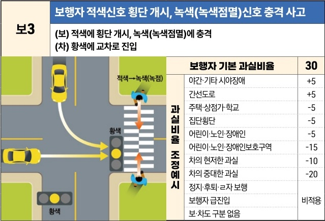
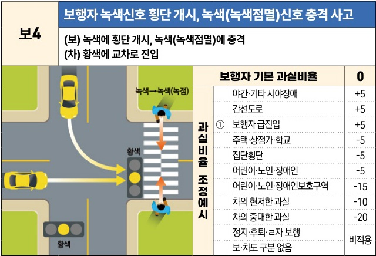

자동차사고 과실비율 인정기준 | 제3편 사고유형별 과실비율 적용기준 046 **목차**

| 보3 | 보행자 적색신호 횡단 개시, 녹색(녹색점멸)신호 충격 사고                               |
| -- | -------------------------------------------------------------- |
|    | \*\*(보) 적색에 횡단 개시, 녹색(녹색점멸)에 충격\*\* \*\*(차) 황색에 교차로 진입\*\* |

[The image shows a diagram of a car entering an intersection on a yellow light and colliding with a pedestrian who started crossing on a red light but was struck when the light turned green/flashing green.]

| 보행자 기본 과실비율 | 보행자 기본 과실비율    | 보행자 기본 과실비율 | 30 |
| ----------- | -------------- | ----------- | -- |
| 과실비율 조정예시   | 야간·기타 시야장애     | +5          |    |
|             | 간선도로           | +5          |    |
|             | 주택·상점가·학교      | -5          |    |
|             | 집단횡단           | -5          |    |
|             | 어린이·노인·장애인     | -5          |    |
|             | 어린이·노인·장애인보호구역 | -15         |    |
|             | 차의 현저한 과실      | -10         |    |
|             | 차의 중대한 과실      | -20         |    |
|             | 정지·후퇴·ㄹ자 보행    | 비적용         |    |
|             | 보행자 급진입        | 비적용         |    |
|             | 보·차도 구분 없음     | 비적용         |    |

※사고발생, 손해확대와의 인과관계를 감안하여 기본 과실비율을 가(+), 감(-) 조정 가능합니다.

| 보4 | 보행자 녹색신호 횡단 개시, 녹색(녹색점멸)신호 충격 사고                               |
| -- | -------------------------------------------------------------- |
|    | \*\*(보) 녹색에 횡단 개시, 녹색(녹색점멸)에 충격\*\* \*\*(차) 황색에 교차로 진입\*\* |

[The image shows a diagram of a car entering an intersection on a yellow light and colliding with a pedestrian who started crossing on a green light and was struck while the light was still green/flashing green.]

| 보행자 기본 과실비율 | 보행자 기본 과실비율    | 보행자 기본 과실비율 | 0 |
| ----------- | -------------- | ----------- | - |
| 과실비율 조정예시   | 야간·기타 시야장애     | +5          |   |
|             | 간선도로           | +5          |   |
|             | ① 보행자 급진입      | +5          |   |
|             | 주택·상점가·학교      | -5          |   |
|             | 집단횡단           | -5          |   |
|             | 어린이·노인·장애인     | -5          |   |
|             | 어린이·노인·장애인보호구역 | -15         |   |
|             | 차의 현저한 과실      | -10         |   |
|             | 차의 중대한 과실      | -20         |   |
|             | 정지·후퇴·ㄹ자 보행    | 비적용         |   |
|             | 보·차도 구분 없음     | 비적용         |   |

※사고발생, 손해확대와의 인과관계를 감안하여 기본 과실비율을 가(+), 감(-) 조정 가능합니다.

제1장. 자동차와 보행자의 사고
