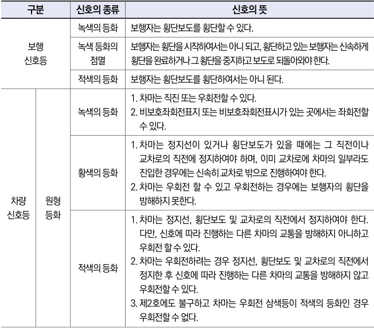

자동차사고 과실비율 인정기준 | 제3편 사고유형별 과실비율 적용기준 051

자전거등을 끌거나 들고 통행하는 자전거등의 운전자를 포함한다)가 횡단보도를 통행하고 있거나 통행하려고 하는 때에는 보행자의 횡단을 방해하거나 위험을 주지 아니하도록 그 횡단보도 앞(정지선이 설치되어 있는 곳에서는 그 정지선을 말한다)에서 일시정지하여야 한다.

② 모든 차 또는 노면전차의 운전자는 교통정리를 하고 있는 교차로에서 좌회전이나 우회전을 하려는 경우에는 신호기 또는 경찰공무원등의 신호나 지시에 따라 도로를 횡단하는 보행자의 통행을 방해하여서는 아니 된다.

**⊙ 도로교통법 제48조(안전운전 및 친환경 경제운전의 의무)**
① 모든 차 또는 노면전차의 운전자는 차 또는 노면전차의 조향장치와 제동장치, 그 밖의 장치를 정확하게 조작하여야 하며, 도로의 교통상황과 차 또는 노면전차의 구조 및 성능에 따라 다른 사람에게 위험과 장해를 주는 속도나 방법으로 운전하여서는 아니 된다.

**⊙ 도로교통법 시행규칙 별표2(신호기가 표시하는 신호의 종류 및 신호의 뜻)**

| 구분     | 신호의 종류    | 신호의 뜻                                                                       |                                                                                                                                                                                                                                         |
| ------ | --------- | --------------------------------------------------------------------------- | --------------------------------------------------------------------------------------------------------------------------------------------------------------------------------------------------------------------------------------- |
| 보행 신호등 | 녹색의 등화    | 보행자는 횡단보도를 횡단할 수 있다.                                                        |                                                                                                                                                                                                                                         |
| 보행 신호등 | 녹색 등화의 점멸 | 보행자는 횡단을 시작하여서는 아니 되고, 횡단하고 있는 보행자는 신속하게 횡단을 완료하거나 그 횡단을 중지하고 보도로 되돌아와야 한다. |                                                                                                                                                                                                                                         |
|        | 적색의 등화    | 보행자는 횡단보도를 횡단하여서는 아니 된다.                                                    |                                                                                                                                                                                                                                         |
| 차량 신호등 | 원형 등화     | 녹색의 등화                                                                      | 1. 차마는 직진 또는 우회전할 수 있다. 2. 비보호좌회전표지 또는 비보호좌회전표시가 있는 곳에서는 좌회전할 수 있다.                                                                                                                                                                 |
| 차량 신호등 |           | 황색의 등화                                                                      | 1. 차마는 정지선이 있거나 횡단보도가 있을 때에는 그 직전이나 교차로의 직전에 정지하여야 하며, 이미 교차로에 차마의 일부라도 진입한 경우에는 신속히 교차로 밖으로 진행하여야 한다. 2. 차마는 우회전 할 수 있고 우회전하는 경우에는 보행자의 횡단을 방해하지 못한다.                                                                              |
| 차량 신호등 |           | 적색의 등화                                                                      | 1. 차마는 정지선, 횡단보도 및 교차로의 직전에서 정지하여야 한다. 다만, 신호에 따라 진행하는 다른 차마의 교통을 방해하지 아니하고 우회전 할 수 있다. 2. 차마는 우회전하려는 경우 정지선, 횡단보도 및 교차로의 직전에서 정지한 후 신호에 따라 진행하는 다른 차마의 교통을 방해하지 않고 우회전할 수 있다. 3. 제2호에도 불구하고 차마는 우회전 삼색등이 적색의 등화인 경우 우회전할 수 없다. |

제1장. 자동차와 보행자의 사고
