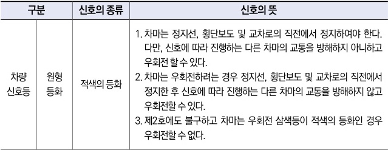

자동차사고 과실비율 인정기준 | 제3편 사고유형별 과실비율 적용기준 055

| 구분     | 신호의 종류 | 신호의 뜻  |                                                                                                                                                                                                                                         |
| ------ | ------ | ------ | --------------------------------------------------------------------------------------------------------------------------------------------------------------------------------------------------------------------------------------- |
| 차량 신호등 | 원형 등화  | 적색의 등화 | 1. 차마는 정지선, 횡단보도 및 교차로의 직전에서 정지하여야 한다. 다만, 신호에 따라 진행하는 다른 차마의 교통을 방해하지 아니하고 우회전 할 수 있다. 2. 차마는 우회전하려는 경우 정지선, 횡단보도 및 교차로의 직전에서 정지한 후 신호에 따라 진행하는 다른 차마의 교통을 방해하지 않고 우회전할 수 있다. 3. 제2호에도 불구하고 차마는 우회전 삼색등이 적색의 등화인 경우 우회전할 수 없다. |

### <mark>참고 판례</mark>

**⊙ 서울고등법원 2002. 11. 15. 선고 2002나4535 판결**
주간에 신호등 있는 사거리(十자) 교차로에서 B차량이 좌회전 하던 중 전방주시 및 보행자 보호의무를 소홀히 한 과실로 때마침 횡단보도의 녹색신호에 진입하여 신호가 적색으로 바뀔 때까지 미처 도로를 횡단하지 못한 A(노인)를 사고차량의 좌측면으로 충격한 후 넘어진 A의 우측손을 사고차량의 뒷바퀴로 역과하여 상해를 입게하여 치료 도중 사망에 이르게 한 사고 : A과실 20%

제1장. 자동차와 보행자의 사고
