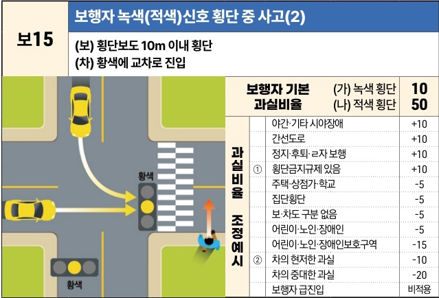
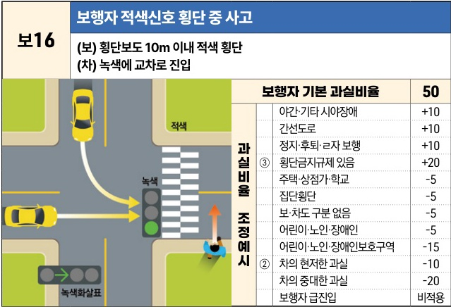

자동차사고 과실비율 인정기준 | 제3편 사고유형별 과실비율 적용기준 073

| 보15 | 보행자 녹색(적색)신호 횡단 중 사고(2)                               |
| --- | ----------------------------------------------------- |
|     | \*\*(보) 횡단보도 10m 이내 횡단\*\* \*\*(차) 황색에 교차로 진입\*\* |

[The image shows a diagram of a car entering an intersection on a yellow light while a pedestrian is crossing near a crosswalk.]

| 보행자 기본 과실비율 과실비율 조정예시 | (가) 녹색 횡단 (나) 적색 횡단 야간·기타 시야장애 간선도로 정지·후퇴·ㄹ자 보행 ① 횡단금지규제 있음 주택·상점가·학교 집단횡단 보·차도 구분 없음 어린이·노인·장애인 어린이·노인·장애인보호구역 ② 차의 현저한 과실 차의 중대한 과실 보행자 급진입 | (가) 녹색 횡단 (나) 적색 횡단 +10 +10 +10 +10 -5 -5 -5 -5 -15 -10 -20 비적용 | 10 50 +10 +10 +10 +10 -5 -5 -5 -5 -15 -10 -20 비적용 |
| ------------------------- | ------------------------------------------------------------------------------------------------------------------------------------------------------------------------------------------------- | ------------------------------------------------------------------------------------------------------------------- | ----------------------------------------------------------------------------------------------------- |

※사고발생, 손해확대와의 인과관계를 감안하여 기본 과실비율을 가(+), 감(-) 조정 가능합니다.

| 보16 | 보행자 적색신호 횡단 중 사고                                         |
| --- | -------------------------------------------------------- |
|     | \*\*(보) 횡단보도 10m 이내 적색 횡단\*\* \*\*(차) 녹색에 교차로 진입\*\* |

[The image shows a diagram of a car entering an intersection on a green light while a pedestrian is crossing on a red light near a crosswalk.]

| 보행자 기본 과실비율 과실비율 조정예시 | 50 야간·기타 시야장애 간선도로 정지·후퇴·ㄹ자 보행 ③ 횡단금지규제 있음 주택·상점가·학교 집단횡단 보·차도 구분 없음 어린이·노인·장애인 어린이·노인·장애인보호구역 ② 차의 현저한 과실 차의 중대한 과실 보행자 급진입 | 50 +10 +10 +10 +20 -5 -5 -5 -5 -15 -10 -20 비적용 |
| ------------------------- | ---------------------------------------------------------------------------------------------------------------------------------------------------------------------------- | ---------------------------------------------------------------------------------------------- |

※사고발생, 손해확대와의 인과관계를 감안하여 기본 과실비율을 가(+), 감(-) 조정 가능합니다.

제1장. 자동차와 보행자의 사고
