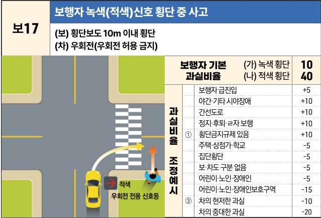
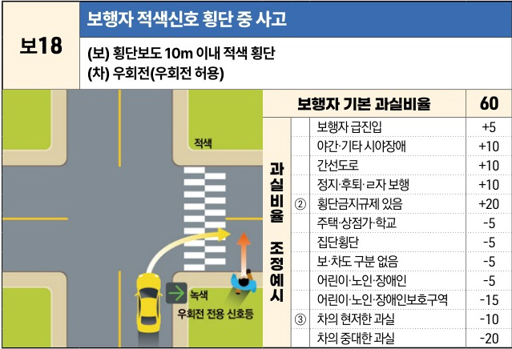

자동차사고 과실비율 인정기준 | 제3편 사고유형별 과실비율 적용기준 077 **목차**

## 2) 우회전 자동차 횡단보도 통과 후(後) [보17~보18]

### 보17 보행자 녹색(적색)신호 횡단 중 사고
**(보) 횡단보도 10m 이내 횡단**
**(차) 우회전(우회전 허용 금지)**

| 보행자 기본 과실비율 | 보행자 기본 과실비율 | 보행자 기본 과실비율    | (가) 녹색 횡단 (나) 적색 횡단 | 10 40 |
| ----------- | ----------- | -------------- | ----------------------- | --------- |
| 과실비율 조정 예시  | ①           | 보행자 급진입        | +5                      |           |
|             |             | 야간·기타 시야장애     | +10                     |           |
|             |             | 간선도로           | +10                     |           |
|             |             | 정지·후퇴·ㄹ자 보행    | +10                     |           |
|             |             | 횡단금지규제 있음      | +10                     |           |
|             |             | 주택·상점가·학교      | -5                      |           |
|             |             | 집단횡단           | -5                      |           |
|             |             | 보·차도 구분 없음     | -5                      |           |
|             |             | 어린이·노인·장애인     | -5                      |           |
|             |             | 어린이·노인·장애인보호구역 | -15                     |           |
|             | ③           | 차의 현저한 과실      | -10                     |           |
|             |             | 차의 중대한 과실      | -20                     |           |

※사고발생, 손해확대와의 인과관계를 감안하여 기본 과실비율을 가(+), 감(-) 조정 가능합니다.

----

### 보18 보행자 적색신호 횡단 중 사고
**(보) 횡단보도 10m 이내 적색 횡단**
**(차) 우회전(우회전 허용)**

| 보행자 기본 과실비율 | 보행자 기본 과실비율 | 보행자 기본 과실비율    | 60  |
| ----------- | ----------- | -------------- | --- |
| 과실비율 조정 예시  | ②           | 보행자 급진입        | +5  |
|             |             | 야간·기타 시야장애     | +10 |
|             |             | 간선도로           | +10 |
|             |             | 정지·후퇴·ㄹ자 보행    | +10 |
|             |             | 횡단금지규제 있음      | +20 |
|             |             | 주택·상점가·학교      | -5  |
|             |             | 집단횡단           | -5  |
|             |             | 보·차도 구분 없음     | -5  |
|             |             | 어린이·노인·장애인     | -5  |
|             |             | 어린이·노인·장애인보호구역 | -15 |
|             | ③           | 차의 현저한 과실      | -10 |
|             |             | 차의 중대한 과실      | -20 |

※사고발생, 손해확대와의 인과관계를 감안하여 기본 과실비율을 가(+), 감(-) 조정 가능합니다.

제1장. 자동차와 보행자의 사고
제2장. 자동차와 자동차(이륜차 포함)의 사고
제3장. 자동차와 자전거(농기계 포함)의 사고
