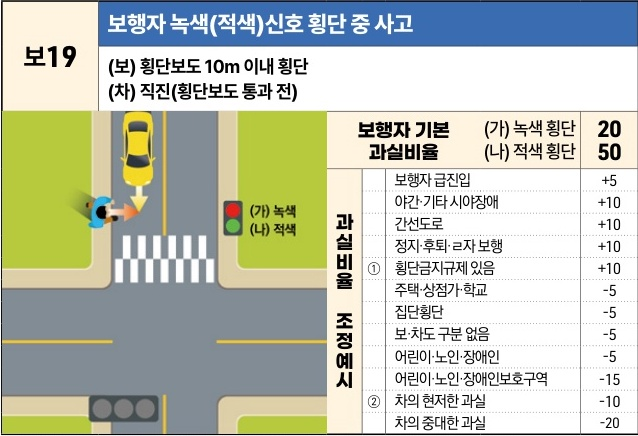

자동차사고 과실비율 인정기준 | 제3편 사고유형별 과실비율 적용기준 081 **목차**

### 3) 자동차 횡단보도 통과 전(前) [보19]

| 보19 | 보행자 녹색(적색)신호 횡단 중 사고 (보) 횡단보도 10m 이내 횡단(차) 직진(횡단보도 통과 전) 보행자 횡단 상황도: 차량이 횡단보도 진입 전이며, 보행자가 횡단보도 10m 이내 구역에서 횡단 중인 상황. 신호등은 (가) 녹색 또는 (나) 적색 상태임. | 보행자 녹색(적색)신호 횡단 중 사고 (보) 횡단보도 10m 이내 횡단(차) 직진(횡단보도 통과 전) 보행자 기본 과실비율과실비율 조정예시 | 보행자 녹색(적색)신호 횡단 중 사고 (보) 횡단보도 10m 이내 횡단(차) 직진(횡단보도 통과 전) (가) 녹색 횡단 (나) 적색 횡단 ①② | 보행자 녹색(적색)신호 횡단 중 사고 (보) 횡단보도 10m 이내 횡단(차) 직진(횡단보도 통과 전) 20 50 보행자 급진입 야간·기타 시야장애 간선도로 정지·후퇴·ㄹ자 보행 횡단금지규제 있음 주택·상점가·학교 집단횡단 보·차도 구분 없음 어린이·노인·장애인 어린이·노인·장애인보호구역 차의 현저한 과실 차의 중대한 과실 | +5 +10 +10 +10 +10 -5 -5 -5 -5 -15 -10 -20 |
| --- | -------------------------------------------------------------------------------------------------------------------------------------------------------- | ------------------------------------------------------------------------------------- | ----------------------------------------------------------------------------------------------- | ------------------------------------------------------------------------------------------------------------------------------------------------------------------------------------------------------------------------------------------------ | -------------------------------------------------------------------------------------- |

※사고발생, 손해확대와의 인과관계를 감안하여 기본 과실비율을 가(+), 감(-) 조정 가능합니다.

#### 사고 상황
* 신호기가 있는 횡단보도 부근에서 횡단보도를 통과하려는 차량이 횡단보도 부근을 건너고 있던 보행자를 충격한 사고이다.

#### 기본 과실비율 해설
* 교차로 통과 전의 사고이므로 차량의 신호는 고려대상이 아니고, 보행자신호가 녹색이지만 보행자가 차량의 진행방향 쪽에서 횡단보도를 벗어나 횡단을 개시한 점을 고려하여 보14~보17 기준 녹색횡단 보행자 과실 10%와는 달리 보행자의 기본 과실비율을 20%로 정하였다.
* 다만, 보행자신호 적색에 횡단을 하였다면 보행자의 과실이 중하므로 보행자의 기본 과실비율을 50%로 정한다.

제1장. 자동차와 보행자의 사고
제2장. 자동차와 자동차(이륜차 포함)의 사고
제3장. 자동차와 자전거(농기계 포함)의 사고
