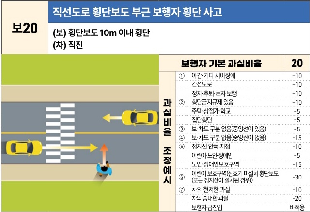
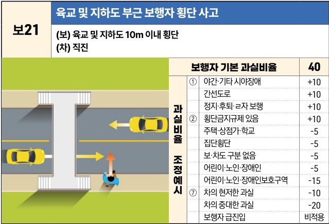

자동차사고 과실비율 인정기준 | 제3편 사고유형별 과실비율 적용기준 084 목차

## (4) 횡단시설 부근(신호등 없음) [보20~보21]

| 보20 (보) 횡단보도 10m 이내 횡단(차) 직진                                                                                                                | 보20 (보) 횡단보도 10m 이내 횡단(차) 직진                 | 직선도로 횡단보도 부근 보행자 횡단 사고 (보) 횡단보도 10m 이내 횡단(차) 직진 | 직선도로 횡단보도 부근 보행자 횡단 사고 (보) 횡단보도 10m 이내 횡단(차) 직진 |
| ----------------------------------------------------------------------------------------------------------------------------------------------- | ------------------------------------------------ | --------------------------------------------------- | --------------------------------------------------- |
| The image shows a diagram of a car driving straight on a road with a crosswalk, and a pedestrian crossing the road within 10m of the crosswalk. | 보행자 기본 과실비율                                      | 20                                                  |                                                     |
|                                                                                                                                                 | 과 실 비 율  조 정 예 시 | ① 야간·기타 시야장애                                        | +10                                                 |
|                                                                                                                                                 |                                                  | 간선도로                                                | +10                                                 |
|                                                                                                                                                 |                                                  | 정지·후퇴·ㄹ자 보행                                         | +10                                                 |
|                                                                                                                                                 |                                                  | ② 횡단금지규제 있음                                         | +10                                                 |
|                                                                                                                                                 |                                                  | 주택·상점가·학교                                           | -5                                                  |
|                                                                                                                                                 |                                                  | 집단횡단                                                | -5                                                  |
|                                                                                                                                                 |                                                  | ③ 보·차도 구분 없음(중앙선이 있음)                               | -5                                                  |
|                                                                                                                                                 |                                                  | ④ 보·차도 구분 없음(중앙선이 없음)                               | -15                                                 |
|                                                                                                                                                 |                                                  | ⑤ 정지선 안쪽 지점                                         | -10                                                 |
|                                                                                                                                                 |                                                  | 어린이·노인·장애인                                          | -5                                                  |
|                                                                                                                                                 |                                                  | 노인·장애인보호구역                                          | -15                                                 |
|                                                                                                                                                 |                                                  | ⑥ 어린이 보호구역(신호기 미설치 횡단보도 (또는 정지선이 설치된 경우))           | -30                                                 |
|                                                                                                                                                 |                                                  | ⑦ 차의 현저한 과실                                         | -10                                                 |
|                                                                                                                                                 |                                                  | 차의 중대한 과실                                           | -20                                                 |
|                                                                                                                                                 |                                                  | 보행자 급진입                                             | 비적용                                                 |

※사고발생, 손해확대와의 인과관계를 감안하여 기본 과실비율을 가(+), 감(-) 조정 가능합니다.

| 보21 (보) 육교 및 지하도 10m 이내 횡단(차) 직진                                                                                                                     | 보21 (보) 육교 및 지하도 10m 이내 횡단(차) 직진             | 육교 및 지하도 부근 보행자 횡단 사고 (보) 육교 및 지하도 10m 이내 횡단(차) 직진 | 육교 및 지하도 부근 보행자 횡단 사고 (보) 육교 및 지하도 10m 이내 횡단(차) 직진 |
| -------------------------------------------------------------------------------------------------------------------------------------------------------- | ------------------------------------------------ | ------------------------------------------------------ | ------------------------------------------------------ |
| The image shows a diagram of a car driving straight on a road near a pedestrian overpass, and a pedestrian crossing the road within 10m of the overpass. | 보행자 기본 과실비율                                      | 40                                                     |                                                        |
|                                                                                                                                                          | 과 실 비 율  조 정 예 시 | ① 야간·기타 시야장애                                           | +10                                                    |
|                                                                                                                                                          |                                                  | 간선도로                                                   | +10                                                    |
|                                                                                                                                                          |                                                  | 정지·후퇴·ㄹ자 보행                                            | +10                                                    |
|                                                                                                                                                          |                                                  | ② 횡단금지규제 있음                                            | +10                                                    |
|                                                                                                                                                          |                                                  | 주택·상점가·학교                                              | -5                                                     |
|                                                                                                                                                          |                                                  | 집단횡단                                                   | -5                                                     |
|                                                                                                                                                          |                                                  | 보·차도 구분 없음                                             | -5                                                     |
|                                                                                                                                                          |                                                  | 어린이·노인·장애인                                             | -5                                                     |
|                                                                                                                                                          |                                                  | 어린이·노인·장애인보호구역                                         | -15                                                    |
|                                                                                                                                                          |                                                  | ⑦ 차의 현저한 과실                                            | -10                                                    |
|                                                                                                                                                          |                                                  | 차의 중대한 과실                                              | -20                                                    |
|                                                                                                                                                          |                                                  | 보행자 급진입                                                | 비적용                                                    |

※사고발생, 손해확대와의 인과관계를 감안하여 기본 과실비율을 가(+), 감(-) 조정 가능합니다.

제1장. 자동차와 보행자의 사고
제2장. 자동차와 자동차(이륜차 포함)의 사고
제3장. 자동차와 자전거(농기계 포함)의 사고
