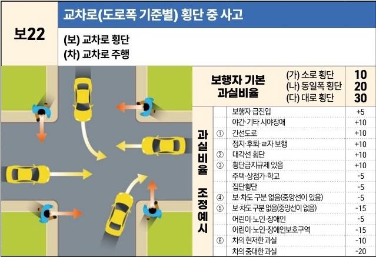

자동차사고 과실비율 인정기준 | 제3편 사고유형별 과실비율 적용기준 089 목차

# (5) 횡단보도 없음

## 1) 도로 유형별 [보22~보23]

### 보22 교차로(도로폭 기준별) 횡단 중 사고
(보) 교차로 횡단
(차) 교차로 주행

[The image shows a diagram of a four-way intersection without traffic lights. Multiple cars are shown moving through the intersection (straight, left turn, right turn), and pedestrians are shown crossing the roads at various points within the intersection area.]

| 보22                                                                                                                                                                                                                                                                     | 교차로(도로폭 기준별) 횡단 중 사고 (보) 교차로 횡단(차) 교차로 주행 | 교차로(도로폭 기준별) 횡단 중 사고 (보) 교차로 횡단(차) 교차로 주행 | 교차로(도로폭 기준별) 횡단 중 사고 (보) 교차로 횡단(차) 교차로 주행 | 교차로(도로폭 기준별) 횡단 중 사고 (보) 교차로 횡단(차) 교차로 주행 | 교차로(도로폭 기준별) 횡단 중 사고 (보) 교차로 횡단(차) 교차로 주행 |
| ----------------------------------------------------------------------------------------------------------------------------------------------------------------------------------------------------------------------------------------------------------------------- | --------------------------------------------- | --------------------------------------------- | --------------------------------------------- | --------------------------------------------- | --------------------------------------------- |
| \[The image shows a diagram of a four-way intersection without traffic lights. Multiple cars are shown moving through the intersection (straight, left turn, right turn), and pedestrians are shown crossing the roads at various points within the intersection area.] |                                               |                                               | 보행자 기본 과실비율                                   | (가) 소로 횡단 10                                  |                                               |
|                                                                                                                                                                                                                                                                         | (나) 동일폭 횡단 20                                 |                                               |                                               |                                               |                                               |
|                                                                                                                                                                                                                                                                         | (다) 대로 횡단 30                                  |                                               |                                               |                                               |                                               |
|                                                                                                                                                                                                                                                                         | 과실비율 조정예시                                     | 보행자 급진입 +5                                    |                                               |                                               |                                               |
|                                                                                                                                                                                                                                                                         |                                               | 야간·기타 시야장애 +10                                |                                               |                                               |                                               |
|                                                                                                                                                                                                                                                                         |                                               | ①                                             | 간선도로 +10                                      |                                               |                                               |
|                                                                                                                                                                                                                                                                         |                                               |                                               | 정지·후퇴·ㄹ자 보행 +10                               |                                               |                                               |
|                                                                                                                                                                                                                                                                         |                                               |                                               | ②                                             | 대각선 횡단 +10                                    |                                               |
|                                                                                                                                                                                                                                                                         |                                               |                                               | ③                                             | 횡단금지규제 있음 +10                                 |                                               |
|                                                                                                                                                                                                                                                                         |                                               | 주택·상점가·학교 -5                                  |                                               |                                               |                                               |
|                                                                                                                                                                                                                                                                         |                                               | 집단횡단 -5                                       |                                               |                                               |                                               |
|                                                                                                                                                                                                                                                                         |                                               | ④                                             | 보·차도 구분 없음(중앙선이 있음) -5                        |                                               |                                               |
|                                                                                                                                                                                                                                                                         |                                               | ⑤                                             | 보·차도 구분 없음(중앙선이 없음) -15                       |                                               |                                               |
|                                                                                                                                                                                                                                                                         |                                               | 어린이·노인·장애인 -5                                 |                                               |                                               |                                               |
|                                                                                                                                                                                                                                                                         |                                               | 어린이·노인·장애인보호구역 -15                            |                                               |                                               |                                               |
|                                                                                                                                                                                                                                                                         |                                               | ⑥                                             | 차의 현저한 과실 -10                                 |                                               |                                               |
|                                                                                                                                                                                                                                                                         |                                               |                                               | 차의 중대한 과실 -20                                 |                                               |                                               |

※사고발생, 손해확대와의 인과관계를 감안하여 기본 과실비율을 가(+), 감(-) 조정 가능합니다.

#### 사고 상황
* 신호등이 없는 교차로에서 진행(직진, 우회전, 좌회전 포함) 중인 차량이 교차로 내부나 그 부근의 도로를 횡단하는 보행자를 충격한 사고이다.
* 사고도로에 보·차도 구분이나 중앙선 설치 여부에 관계없이 본 기준을 적용한다.

#### 기본 과실비율 해설
* 도로교통법 제27조 제3항에 따라 차량은 신호등이 없는 교차로나 그 부근의 도로를 횡단하는 보행자를 보호할 의무가 있으며,
* 보행자가 횡단한 도로 폭과 차량이 통과하는 도로 폭을 감안하여 보행자가 횡단하는 도로 폭이 클수록 주의의무가 크므로 도로 폭이 좁을 때는 10%, 넓을 때는 30%, 차량이 통과하는 도로 폭과 같을 때는 20%를 각각 보행자의 기본 과실비율로 정하였다.

제1장. 자동차와 보행자의 사고
제2장. 자동차와 자동차(이륜차 포함)의 사고
제3장. 자동차와 자전거(농기계 포함)의 사고
