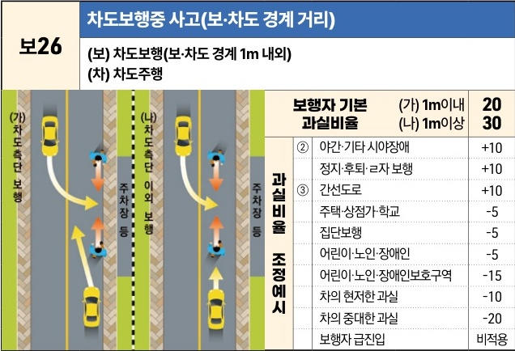

자동차사고 과실비율 인정기준 | 제3편 사고유형별 과실비율 적용기준 097 **목차**

| 보26 | 차도보행중 사고(보·차도 경계 거리)                                 |
| --- | ---------------------------------------------------- |
|     | \*\*(보) 차도보행(보·차도 경계 1m 내외)\*\* \*\*(차) 차도주행\*\* |

[The image illustrates two scenarios of a car hitting a pedestrian on a road with sidewalks. Scenario (가) shows a pedestrian walking within 1m of the sidewalk edge (차도측단 보행). Scenario (나) shows a pedestrian walking more than 1m away from the sidewalk edge (차도측단 이외 보행). Cars are shown moving straight or turning into/out of non-road areas like parking lots.]

|           | 보행자 기본 과실비율 보행자 기본 과실비율 | (가) 1m이내 (나) 1m이상 | 20 30 |
| --------- | --------------------------- | --------------------- | --------- |
| 과실비율 조정예시 | ② 야간·기타 시야장애                | +10                   |           |
|           | 정지·후퇴·ㄹ자 보행                 | +10                   |           |
|           | ③ 간선도로                      | +10                   |           |
|           | 주택·상점가·학교                   | -5                    |           |
|           | 집단보행                        | -5                    |           |
|           | 어린이·노인·장애인                  | -5                    |           |
|           | 어린이·노인·장애인보호구역              | -15                   |           |
|           | 차의 현저한 과실                   | -10                   |           |
|           | 차의 중대한 과실                   | -20                   |           |
|           | 보행자 급진입                     | 비적용                   |           |

※사고발생, 손해확대와의 인과관계를 감안하여 기본 과실비율을 가(+), 감(-) 조정 가능합니다.

### 사고 상황

*   <mark>보24</mark> 보도와 차도의 구분이 있는 도로에서 차도를 진행하는 차량이 “차도가 아닌 장소”로 진출 또는 “차도가 아닌 장소”에서 차도로 진입하다가 보도 위를 걷고 있는 보행자를 충격한 사고이다.

*   <mark>보25</mark> 보도와 차도의 구분이 있는 도로에서 차도를 진행하는 차량이 도로공사 등 부득이한 사유로 도로교통법 제8조 제1항에 따라 차도를 통행하는 보행자를 충격한 사고이다.

*   <mark>보26</mark> 보도와 차도의 구분이 있는 도로에서 차도를 진행하거나 “차도가 아닌 장소”로 진출하는 차량이 도로교통법 제8조 제1항 상의 부득이한 사유가 없음에도 차도측단 또는 차도측단 이외의 차도를 통행하는 보행자를 충격한 사고이다. 여기서 차도측단이란 보·차도 경계선으로부터 1m 이내의 거리에 있는 차도의 부분을 말한다.

### 기본 과실비율 해설

*   <mark>보24</mark> 차량이 도로교통법 제8조 제1항에 따라 정상적으로 보도를 통행하고 있는 보행자를 충돌한 사고이므로 차량의 일방과실로 정하였다.

제1장. 자동차와 보행자의 사고
제2장. 자동차와 자동차(이륜차 포함)의 사고
제3장. 자동차와 자전거(농기계 포함)의 사고
