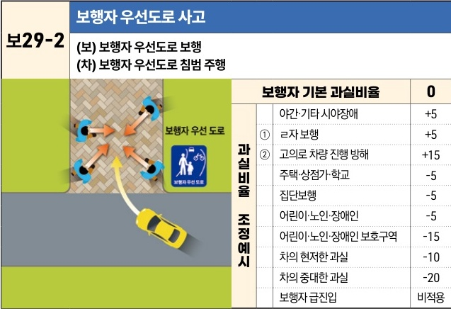

자동차사고 과실비율 인정기준 | 제3편 사고유형별 과실비율 적용기준 108

| 보29-2 | 보행자 우선도로 사고                            |
| ----- | -------------------------------------- |
|       | (보) 보행자 우선도로 보행 (차) 보행자 우선도로 침범 주행 |

[The image shows a diagram of a pedestrian priority road where pedestrians are walking in various directions and a yellow car is entering the area. A blue sign indicates "Pedestrian Priority Road".]

| 보행자 기본 과실비율 | 0               | 0   |
| ----------- | --------------- | --- |
| 야간·기타 시야장애  | +5              |     |
| 과실비율 조정예시   | ① ㄹ자 보행         | +5  |
|             | ② 고의로 차량 진행 방해  | +15 |
|             | 주택·상점가·학교       | -5  |
|             | 집단보행            | -5  |
|             | 어린이·노인·장애인      | -5  |
|             | 어린이·노인·장애인 보호구역 | -15 |
|             | 차의 현저한 과실       | -10 |
|             | 차의 중대한 과실       | -20 |
|             | 보행자 급진입         | 비적용 |

※사고발생, 손해확대와의 인과관계를 감안하여 기본 과실비율을 가(+), 감(-) 조정 가능합니다.

### 사고 상황
* 도로교통법 제2조 31의2, 제8조 제3항, 제27조 제6항 및 제28조의 2에 따라 설치된 보행자 우선도로에서의 차량과 보행자간 사고이다.

### 기본 과실비율 해설
* 도로교통법 제27조 제6항에 따라 보행자우선도로에서 보행자의 옆을 지나는 경우에 보행자와 거리를 두고 진행해야 하고, 보행자가 안전하게 통행할 수 있도록 서행이나 일시정지를 하여 보행자를 보호할 의무가 있으므로 차량의 일방과실로 정하였다.

### 수정요소(인과관계를 감안한 과실비율 조정) 해설
① 보행자 우선도로에서 보행자는 도로의 전 부분을 통행할 수 있고, 차량 운전자는 보행자와 거리를 두고 진행하는 등 보행자 보호의무가 있으므로, ㄹ자 보행을 하는 경우라도 보행자의 과실을 5%까지 가산할 수 있다.

② 보행자는 도로교통법 제8조 제3항 단서에 따라 고의로 차량의 진행을 방해해서는 아니 되므로, 이러한 경우 보행자의 과실을 15%까지 가산할 수 있다.

제1장. 자동차와 보행자의 사고
