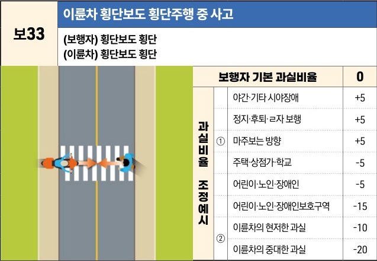

자동차사고 과실비율 인정기준 | 제3편 사고유형별 과실비율 적용기준 116 **목차**

| 보33                                             | 이륜차 횡단보도 횡단주행 중 사고 |
| ----------------------------------------------- | ------------------ |
| \*\*(보행자) 횡단보도 횡단\*\* \*\*(이륜차) 횡단보도 횡단\*\* |                    |

[The image shows a top-down view of a crosswalk on a road. A pedestrian is walking across the crosswalk from right to left, and a motorcycle is being ridden across the same crosswalk from left to right, heading towards the pedestrian.]

| 보행자 기본 과실비율 | 보행자 기본 과실비율    | 보행자 기본 과실비율 | 0   |
| ----------- | -------------- | ----------- | --- |
| 과실비율 조정예시   | 야간·기타 시야장애     | +5          |     |
|             | 정지·후퇴·ㄹ자 보행    | +5          |     |
|             | ① 마주보는 방향      | +5          |     |
|             | 주택·상점가·학교      | -5          |     |
|             | 어린이·노인·장애인     | -5          |     |
|             | 어린이·노인·장애인보호구역 | -15         |     |
|             | ②              | 이륜차의 현저한 과실 | -10 |
|             | 이륜차의 중대한 과실    |             | -20 |

※사고발생, 손해확대와의 인과관계를 감안하여 기본 과실비율을 가(+), 감(-) 조정 가능합니다.

### 사고 상황
◉ 횡단보도에서 이륜차 운전자가 이륜차를 운전하여 횡단보도를 건너다가 횡단보도를 건너고 있던 보행자를 충격한 사고이다.

### 기본 과실비율 해설
◉ 도로교통법 제13조 제5항에 따라 이륜차는 횡단보도를 따라 진행할 수 없으므로 이륜차의 일방과실로 정하였다.

### 수정요소(인과관계를 감안한 과실비율 조정) 해설
① 이륜차와 보행자가 서로 반대편에서 횡단보도를 건너는 경우에는 보행자 역시 이륜차의 동태를 확인할 수 있으므로 보행자의 과실을 5%까지 가산할 수 있다.

② ‘이륜차의 현저한 과실’ 및 ‘이륜차의 중대한 과실’ 해당 여부는 이 장의 3. 수정요소 해설에 따르며, 경합시 후자를 적용하고 중복적용하지 아니한다.

제1장. 자동차와 보행자의 사고
제2장. 자동차와 자동차(이륜차 포함)의 사고
제3장. 자동차와 자전거(농기계 포함)의 사고
