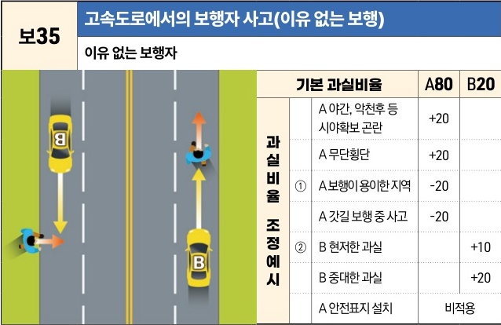
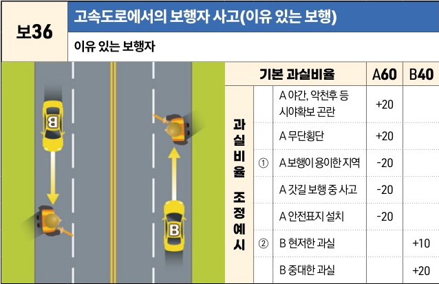

자동차사고 과실비율 인정기준 | 제3편 사고유형별 과실비율 적용기준 120 **목차**

| 보35               | 고속도로에서의 보행자 사고(이유 없는 보행) |
| ----------------- | ------------------------ |
| \*\*이유 없는 보행자\*\* |                          |

[The image illustrates two scenarios on a highway. In the first, a pedestrian (A) is crossing the road from the left while a car (B) is approaching in the same lane. In the second, a pedestrian (A) is walking along the right shoulder while a car (B) is approaching from behind.]

|            | 기본 과실비율   | 기본 과실비율             | 기본 과실비율      | A80 | B20 |
| ---------- | --------- | ------------------- | ------------ | --- | --- |
| 과실비율 조정 예시 | ①         | A 야간, 악천후 등 시야확보 곤란 | +20          |     |     |
|            |           |                     | A 무단횡단       | +20 |     |
|            |           |                     | A 보행이 용이한 지역 | -20 |     |
|            |           |                     | A 갓길 보행 중 사고 | -20 |     |
|            | ②         | B 현저한 과실            |              | +10 |     |
|            |           |                     | B 중대한 과실     |     | +20 |
|            | A 안전표지 설치 |                     | 비적용          |     |     |

※사고발생, 손해확대와의 인과관계를 감안하여 기본 과실비율을 가(+), 감(-) 조정 가능합니다.
※舊 509 기준

 

| 보36               | 고속도로에서의 보행자 사고(이유 있는 보행) |
| ----------------- | ------------------------ |
| \*\*이유 있는 보행자\*\* |                          |

[The image illustrates two scenarios on a highway. In the first, a pedestrian (A) is crouched on the left shoulder near a car (B) that has stopped. In the second, a pedestrian (A) is crouched on the right shoulder while a car (B) is approaching from behind.]

|            | 기본 과실비율 | 기본 과실비율             | 기본 과실비율      | A60 | B40 |
| ---------- | ------- | ------------------- | ------------ | --- | --- |
| 과실비율 조정 예시 | ①       | A 야간, 악천후 등 시야확보 곤란 | +20          |     |     |
|            |         |                     | A 무단횡단       | +20 |     |
|            |         |                     | A 보행이 용이한 지역 | -20 |     |
|            |         |                     | A 갓길 보행 중 사고 | -20 |     |
|            |         |                     | A 안전표지 설치    | -20 |     |
|            | ②       | B 현저한 과실            |              | +10 |     |
|            |         |                     | B 중대한 과실     |     | +20 |

※사고발생, 손해확대와의 인과관계를 감안하여 기본 과실비율을 가(+), 감(-) 조정 가능합니다.
※舊 510 기준

제1장. 자동차와 보행자의 사고
