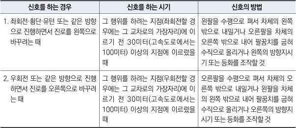

자동차사고 과실비율 인정기준 | 제3편 사고유형별 과실비율 적용기준 141 목차

> **도로교통법 시행령 제21조(신호의 시기 및 방법)**
> 법 제38조 제1항에 따른 신호의 시기 및 방법은 별표2와 같다.
>
> **신호의 시기 및 방법(제21조 관련)**
> 

| 신호를 하는 경우                                     | 신호를 하는 시기                                                                     | 신호의 방법                                                                                    |
| --------------------------------------------- | ----------------------------------------------------------------------------- | ----------------------------------------------------------------------------------------- |
| 1. 좌회전·횡단·유턴 또는 같은 방향으로 진행하면서 진로를 왼쪽으로 바꾸려는 때 | 그 행위를 하려는 지점(좌회전할 경우에는 그 교차로의 가장자리)에 이르기 전 30미터(고속도로에서는 100미터) 이상의 지점에 이르렀을 때 | 왼팔을 수평으로 펴서 차체의 왼쪽 밖으로 내밀거나 오른팔을 차체의 오른쪽 밖으로 내어 팔꿈치를 굽혀 수직으로 올리거나 왼쪽의 방향지시기 또는 등화를 조작할 것  |
| 2. 우회전 또는 같은 방향으로 진행하면서 진로를 오른쪽으로 바꾸려는 때      | 그 행위를 하려는 지점(우회전할 경우에는 그 교차로의 가장자리)에 이르기 전 30미터(고속도로에서는 100미터) 이상의 지점에 이르렀을 때 | 오른팔을 수평으로 펴서 차체의 오른쪽 밖으로 내밀거나 왼팔을 차체의 왼쪽 밖으로 내어 팔꿈치를 굽혀 수직으로 올리거나 오른쪽의 방향지시기 또는 등화를 조작할 것 |

⑨ 차체를 내밀고 대기
- 차가 “차도가 아닌 장소”에서 차도로 진입하는 경우 차체를 차도에 일부 노출시키고 대기를 하다가 진입 중에 사고가 발생시 과실을 감산할 수 있다. 그러나 일부가 아닌 전체에 상당하는 부분이 차도에 대기 및 진입하는 경우는 적용하지 않는다.

⑩ 교차로 정체 중 진입(꼬리물기 등)
- 신호기에 의해 교통정리가 행해지는 교차로에 들어가려는 모든 차는 진로의 앞쪽에 있는 차의 상황에 따라 교차로 내에 정지하게 되어 있어 다른 차의 통행에 방해가 될 우려가 있는 경우에는 그 교차로에 진입해서는 아니되며 이를 위반 시 과실을 가산할 수 있다.(도로교통법 제25조 제5항 참조)

⑪ 회전위험장소, 회전금지장소
- 회전위험장소란 시야가 불량한 굴곡도로, 고개마루 부근, 교차로, 도로의 모퉁이 부근, 차량의 속도가 높고 교통량이 특히 빈번한 도로, 눈이나 비로 인해 미끄러지기 쉬운 장소를 말하며 이를 위반 시 과실을 가산할 수 있다.
- 회전금지장소란 중앙선이나 기타 교통표지에 의해 회전이 금지된 장소를 말한다.

⑫ 안전거리 확보의무 위반
- 모든 차의 운전자는 선행 차량의 흐름에 주의하여 안전거리를 유지하며 운전할 의무가 있다.

제2장. 자동차와 자동차(이륜차 포함)의 사고
