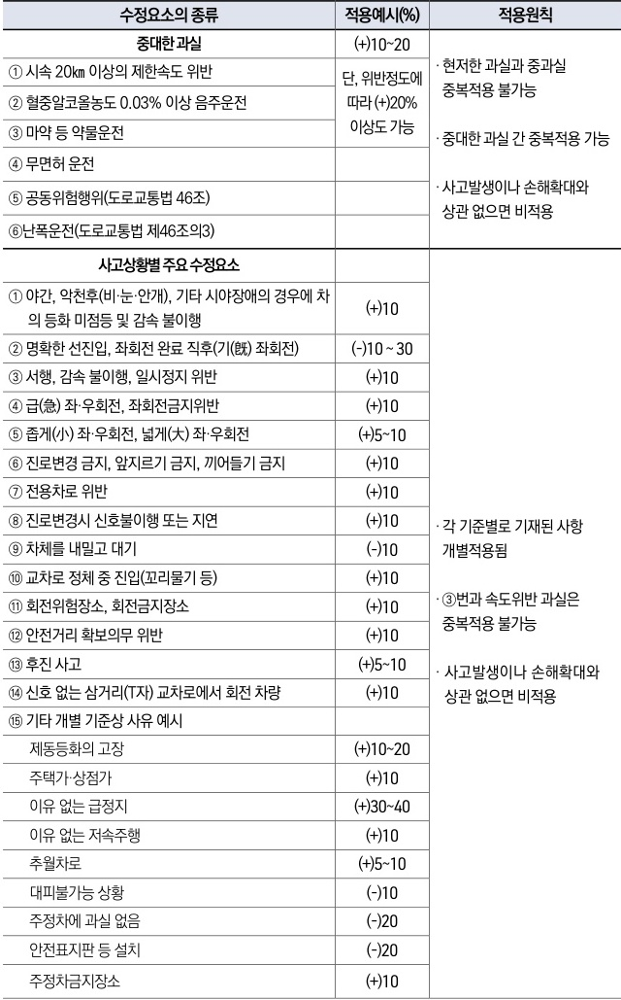

자동차사고 과실비율 인정기준 | 제3편 사고유형별 과실비율 적용기준 145

| 수정요소의 종류                                           | 적용예시(%)                   | 적용원칙                                                                                      |   |
| -------------------------------------------------- | ------------------------- | ----------------------------------------------------------------------------------------- | - |
| 중대한 과실                                             | (+)10\~20                 | · 현저한 과실과 중과실 중복적용 불가능  · 중대한 과실 간 중복적용 가능  · 사고발생이나 손해확대와 상관 없으면 비적용     |   |
| ① 시속 20km 이상의 제한속도 위반                              | 단, 위반정도에 따라 (+)20% 이상도 가능 |                                                                                           |   |
| ② 혈중알코올농도 0.03% 이상 음주운전                            |                           |                                                                                           |   |
| ③ 마약 등 약물운전                                        |                           |                                                                                           |   |
| ④ 무면허 운전                                           |                           |                                                                                           |   |
| ⑤ 공동위험행위(도로교통법 46조)                                |                           |                                                                                           |   |
| ⑥ 난폭운전(도로교통법 제46조의3)                               |                           |                                                                                           |   |
| 사고상황별 주요 수정요소                                      |                           |                                                                                           |   |
| ① 야간, 악천후(비·눈·안개), 기타 시야장애의 경우에 차의 등화 미점등 및 감속 불이행 | (+)10                     | · 각 기준별로 기재된 사항 개별적용됨  · ③번과 속도위반 과실은 중복적용 불가능  · 사고발생이나 손해확대와 상관 없으면 비적용 |   |
| ② 명확한 선진입, 좌회전 완료 직후(기(旣) 좌회전)                     | (-)10\~30                 |                                                                                           |   |
| ③ 서행, 감속 불이행, 일시정지 위반                              | (+)10                     |                                                                                           |   |
| ④ 급(急) 좌·우회전, 좌회전금지위반                              | (+)10                     |                                                                                           |   |
| ⑤ 좁게(小) 좌·우회전, 넓게(大) 좌·우회전                         | (+)5\~10                  |                                                                                           |   |
| ⑥ 진로변경 금지, 앞지르기 금지, 끼어들기 금지                        | (+)10                     |                                                                                           |   |
| ⑦ 전용차로 위반                                          | (+)10                     |                                                                                           |   |
| ⑧ 진로변경시 신호불이행 또는 지연                                | (+)10                     |                                                                                           |   |
| ⑨ 차체를 내밀고 대기                                       | (-)10                     |                                                                                           |   |
| ⑩ 교차로 정체 중 진입(꼬리물기 등)                              | (+)10                     |                                                                                           |   |
| ⑪ 회전위험장소, 회전금지장소                                   | (+)10                     |                                                                                           |   |
| ⑫ 안전거리 확보의무 위반                                     | (+)10                     |                                                                                           |   |
| ⑬ 후진 사고                                            | (+)5\~10                  |                                                                                           |   |
| ⑭ 신호 없는 삼거리(T자) 교차로에서 회전 차량                        | (+)10                     |                                                                                           |   |
| ⑮ 기타 개별 기준상 사유 예시                                  |                           |                                                                                           |   |
| 제동등화의 고장                                           | (+)10\~20                 |                                                                                           |   |
| 주택가·상점가                                            | (+)10                     |                                                                                           |   |
| 이유 없는 급정지                                          | (+)30\~40                 |                                                                                           |   |
| 이유 없는 저속주행                                         | (+)10                     |                                                                                           |   |
| 추월차로                                               | (+)5\~10                  |                                                                                           |   |
| 대피불가능 상황                                           | (-)10                     |                                                                                           |   |
| 주정차에 과실 없음                                         | (-)20                     |                                                                                           |   |
| 안전표지판 등 설치                                         | (-)20                     |                                                                                           |   |
| 주정차금지장소                                            | (+)10                     |                                                                                           |   |

제2장. 자동차와 자동차(이륜차 포함)의 사고
