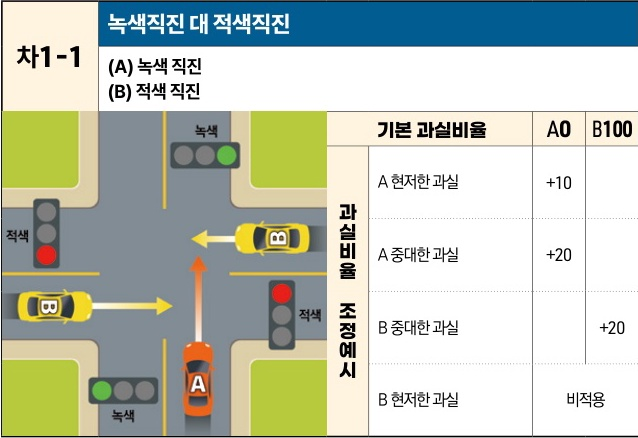

자동차사고 과실비율 인정기준 | 제3편 사고유형별 과실비율 적용기준 147 **목차**

# 4. 세부유형별 과실비율 적용기준
## 가. 교차로(+자로, T자로 등) 사고
### (1) 양쪽 신호등 있는 교차로
#### 1) 직진 대(對) 직진 사고 - 상대차량이 측면에서 진입 [차1]

| 차1-1 | 녹색직진 대 적색직진 (A) 녹색 직진(B) 적색 직진 녹색 신호등 아래에서 위로 직진하는 A차량과 적색 신호등 왼쪽에서 오른쪽으로 직진하는 B차량이 교차로에서 충돌하는 상황도 | 녹색직진 대 적색직진 (A) 녹색 직진(B) 적색 직진 기본 과실비율 과실비율 조정예시 | 녹색직진 대 적색직진 (A) 녹색 직진(B) 적색 직진 A0 A 현저한 과실 A 중대한 과실 B 중대한 과실 B 현저한 과실 | 녹색직진 대 적색직진 (A) 녹색 직진(B) 적색 직진 B100 +10 +20비적용 | 녹색직진 대 적색직진 (A) 녹색 직진(B) 적색 직진+20 | 녹색직진 대 적색직진 (A) 녹색 직진(B) 적색 직진 |
| ---- | ---------------------------------------------------------------------------------------------------------- | ------------------------------------------------------------ | --------------------------------------------------------------------------------------------- | -------------------------------------------------------------- | ------------------------------------- | ---------------------------------- |

※사고발생, 손해확대와의 인과관계를 감안하여 기본 과실비율을 가(+), 감(-) 조정 가능합니다.
※舊 201, 301, 302 기준

### 사고 상황
* 신호기에 의해 교통정리가 이루어지고 있는 교차로에서 서로 다른 도로를 이용하여 녹색 신호에 교차로에 진입하여 직진 중인 A차량과 적색신호에 교차로에 진입하여 직진 중인 B차량이 충돌한 사고이다.

제2장. 자동차와 자동차(이륜차 포함)의 사고
