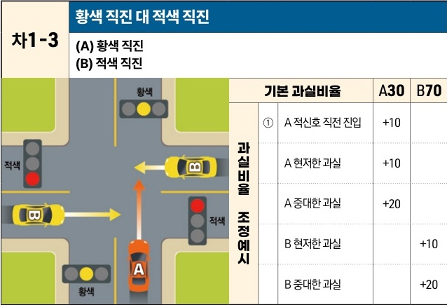

자동차사고 과실비율 인정기준 | 제3편 사고유형별 과실비율 적용기준 154 **목차**

# 차1-3 황색 직진 대 적색 직진
(A) 황색 직진
(B) 적색 직진

[The image shows a diagram of a four-way intersection. Vehicle A (orange) is entering the intersection on a yellow light and proceeding straight. Vehicle B (yellow) is entering the intersection on a red light from the right and proceeding straight, leading to a collision.]

|           | 기본 과실비율       | 기본 과실비율 | 기본 과실비율 | A30 | B70 |
| --------- | ------------- | ------- | ------- | --- | --- |
| 과실비율 조정예시 | ① A 적신호 직전 진입 | +10     |         |     |     |
|           | A 현저한 과실      | +10     |         |     |     |
|           | A 중대한 과실      | +20     |         |     |     |
|           | B 현저한 과실      |         | +10     |     |     |
|           | B 중대한 과실      |         | +20     |     |     |

※사고발생, 손해확대와의 인과관계를 감안하여 기본 과실비율을 가(+), 감(-) 조정 가능합니다.
※舊 203, 303, 304 기준

### 사고 상황
* 신호기에 의해 교통정리가 이루어지고 있는 교차로에서 서로 다른 방향을 이용하여 황색 신호에 교차로에 진입하여 직진 중인 A차량과 적색신호에 교차로에 진입하여 직진 중인 B차량이 충돌한 사고이다.

### 기본 과실비율 해설
* 양 차량 모두 신호위반에 해당하지만, 적색신호에 진입한 B차량의 과실이 더 중하므로 양 차량의 기본 과실비율을 30:70으로 정한다.

제2장. 자동차와 자동차(이륜차 포함)의 사고
