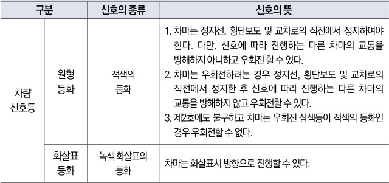

자동차사고 과실비율 인정기준 | 제3편 사고유형별 과실비율 적용기준 164 목차

## <u>관련 법규</u>

**⊙ 도로교통법 제5조(신호 또는 지시에 따를 의무)**
① 도로를 통행하는 보행자, 차마 또는 노면전차의 운전자는 교통안전시설이 표시하는 신호 또는 지시와 다음 각 호의 어느 하나에 해당하는 사람이 하는 신호 또는 지시를 따라야 한다.
1. 교통정리를 하는 경찰공무원(의무경찰을 포함한다. 이하 같다) 및 제주특별자치도의 자치경찰공무원(이하 “자치경찰공무원”이라 한다)
2. 경찰공무원(자치경찰공무원을 포함한다. 이하 같다) 을 보조하는 사람으로서 대통령령으로 정하는 사람(이하 “경찰보조자”라 한다)

**⊙ 도로교통법 제25조(교차로 통행방법)**
⑤ 모든 차 또는 노면전차의 운전자는 신호기로 교통정리를 하고 있는 교차로에 들어가려는 경우에는 진행하려는 진로의 앞쪽에 있는 차 또는 노면전차의 상황에 따라 교차로(정지선이 설치되어 있는 경우에는 그 정지선을 넘은 부분을 말한다)에 정지하게 되어 다른 차 또는 노면전차의 통행에 방해가 될 우려가 있는 경우에는 그 교차로에 들어가서는 아니 된다.

**⊙ 도로교통법 시행규칙 별표2(신호기가 표시하는 신호의 종류 및 신호의 뜻)**

| 구분     | 신호의 종류 | 신호의 뜻  |                                                                                                                                                                                                                                         |            |                         |
| ------ | ------ | ------ | --------------------------------------------------------------------------------------------------------------------------------------------------------------------------------------------------------------------------------------- | ---------- | ----------------------- |
| 차량 신호등 | 원형 등화  | 적색의 등화 | 1. 차마는 정지선, 횡단보도 및 교차로의 직전에서 정지하여야 한다. 다만, 신호에 따라 진행하는 다른 차마의 교통을 방해하지 아니하고 우회전 할 수 있다. 2. 차마는 우회전하려는 경우 정지선, 횡단보도 및 교차로의 직전에서 정지한 후 신호에 따라 진행하는 다른 차마의 교통을 방해하지 않고 우회전할 수 있다. 3. 제2호에도 불구하고 차마는 우회전 삼색등이 적색의 등화인 경우 우회전할 수 없다. |            |                         |
| 차량 신호등 |        |        | 화살표 등화                                                                                                                                                                                                                                  | 녹색 화살표의 등화 | 차마는 화살표시 방향으로 진행할 수 있다. |

## <u>참고 판례</u>

**⊙ 인천지방법원 1993. 12. 23. 선고 93가단5580 판결**
주간에 신호기 있는 사거리(十자) 교차로에서 A차량이 차량정지신호가 들어왔음에도 불구하고 직진한 과실로, 반대방향에서 녹색화살표신호에 따라 좌회전하던 B차량을 충돌한 사고: B과실 0%

제2장. 자동차와 자동차(이륜차 포함)의 사고
