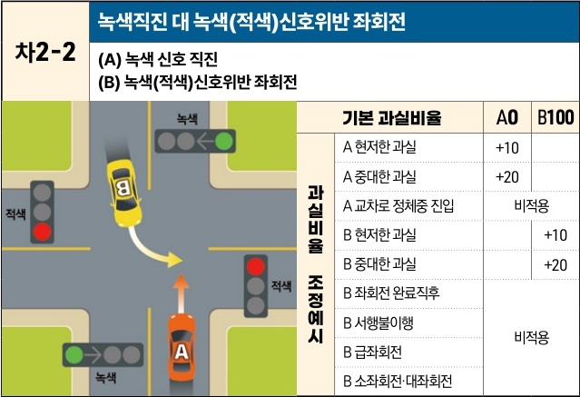

자동차사고 과실비율 인정기준 | 제3편 사고유형별 과실비율 적용기준 166 목차

# 차2-2 녹색직진 대 녹색(적색)신호위반 좌회전
(A) 녹색 신호 직진
(B) 녹색(적색)신호위반 좌회전

[The image shows a diagram of a four-way intersection. Vehicle A (orange) is proceeding straight on a green light. Vehicle B (yellow) is coming from the opposite direction and making a left turn while the signal for its direction is green (but without a left-turn arrow) or red, leading to a collision in the intersection.]

| 과실비율 조정예시 | 기본 과실비율      | A 0 | B 100 |
| --------- | ------------ | --- | ----- |
| 과실비율 조정예시 | A 현저한 과실     | +10 |       |
| 과실비율 조정예시 | A 중대한 과실     | +20 |       |
| 과실비율 조정예시 | A 교차로 정체중 진입 | 비적용 |       |
| 과실비율 조정예시 | B 현저한 과실     |     | +10   |
| 과실비율 조정예시 | B 중대한 과실     |     | +20   |
| 과실비율 조정예시 | B 좌회전 완료직후   | 비적용 | 비적용   |
| 과실비율 조정예시 | B 서행불이행      | 비적용 | 비적용   |
| 과실비율 조정예시 | B 급좌회전       | 비적용 | 비적용   |
| 과실비율 조정예시 | B 소좌회전·대좌회전  | 비적용 | 비적용   |

※사고발생, 손해확대와의 인과관계를 감안하여 기본 과실비율을 가(+), 감(-) 조정 가능합니다.
※舊 210, 316, 317 기준

## 사고 상황
* 신호기에 의해 교통정리가 이루어지고 있는 교차로에서 녹색신호에 직진하는 A차량과 맞은편 방향에서 녹색신호에 좌회전(비보호 좌회전이 아님) 또는 적색신호에 좌회전하는 좌회전 신호위반 B차량이 충돌한 사고이다.

## 기본 과실비율 해설
* 신호기가 있는 교차로에서 신호는 양 차량 운전자가 신뢰하는 것으로, A차량은 B차량이 좌회전 화살표 신호가 아닌 녹색이나 적색에 신호를 위반하여 좌회전할 것을 예상하고 주의해야 할 이유가 없으므로 B차량의 일방 과실비율로 정한다.

## 수정요소(인과관계를 감안한 과실비율 조정) 해설
* 제3편 제2장 3. 수정요소의 해설 부분을 참조한다.

제2장. 자동차와 자동차(이륜차 포함)의 사고
