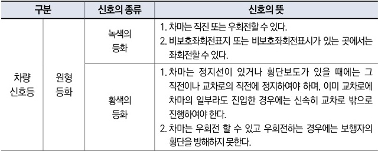

자동차사고 과실비율 인정기준 | 제3편 사고유형별 과실비율 적용기준 170

<u>**관련 법규**</u>

**◉ 도로교통법 제5조(신호 또는 지시에 따를 의무)**
① 도로를 통행하는 보행자, 차마 또는 노면전차의 운전자는 교통안전시설이 표시하는 신호 또는 지시와 다음 각 호의 어느 하나에 해당하는 사람이 하는 신호 또는 지시를 따라야 한다.
1. 교통정리를 하는 경찰공무원(의무경찰을 포함한다. 이하 같다) 및 제주특별자치도의 자치경찰공무원(이하 “자치경찰공무원”이라 한다)
2. 경찰공무원(자치경찰공무원을 포함한다. 이하 같다) 을 보조하는 사람으로서 대통령령으로 정하는 사람(이하 “경찰보조자”라 한다)

**◉ 도로교통법 제25조(교차로 통행방법)**
⑤ 모든 차 또는 노면전차의 운전자는 신호기로 교통정리를 하고 있는 교차로에 들어가려는 경우에는 진행하려는 진로의 앞쪽에 있는 차 또는 노면전차의 상황에 따라 교차로(정지선이 설치되어 있는 경우에는 그 정지선을 넘은 부분을 말한다)에 정지하게 되어 다른 차 또는 노면전차의 통행에 방해가 될 우려가 있는 경우에는 그 교차로에 들어가서는 아니 된다.

**◉ 도로교통법 시행규칙 별표2(신호기가 표시하는 신호의 종류 및 신호의 뜻)**

| 구분     | 신호의 종류 | 신호의 뜻  |                                                                                                                                                            |
| ------ | ------ | ------ | ---------------------------------------------------------------------------------------------------------------------------------------------------------- |
| 차량 신호등 | 원형 등화  | 녹색의 등화 | 1. 차마는 직진 또는 우회전할 수 있다. 2. 비보호좌회전표지 또는 비보호좌회전표시가 있는 곳에서는 좌회전할 수 있다.                                                                                    |
| 차량 신호등 |        | 황색의 등화 | 1. 차마는 정지선이 있거나 횡단보도가 있을 때에는 그 직전이나 교차로의 직전에 정지하여야 하며, 이미 교차로에 차마의 일부라도 진입한 경우에는 신속히 교차로 밖으로 진행하여야 한다. 2. 차마는 우회전 할 수 있고 우회전하는 경우에는 보행자의 횡단을 방해하지 못한다. |

<u>**참고 판례**</u>

**◉ 서울고등법원 1986. 12. 30. 선고 86나2674 판결**
야간에 신호등이 설치된 사거리(十자) 교차로에서 B차량이 좌회전하던 중 교차로 진입선을 넘는 순간 좌회전 신호에서 황색 또는 적색의 정지신호로 바뀌는데도 불구하고 그 진입선 직전 또는 교차로 직전에 정지하지 아니하였음은 물론 전방좌우를 제대로 살피지 아니한 채 서둘러 좌회전한 과실로 맞은 편에서 술에 취한 채 적색의 정지신호에 직진하여 오던 A이륜차(무면허)의 앞바퀴 부분을 위 차량의 좌측 앞 범퍼부분으로 들이받은 사고: B과실 40%

제2장. 자동차와 자동차(이륜차 포함)의 사고
