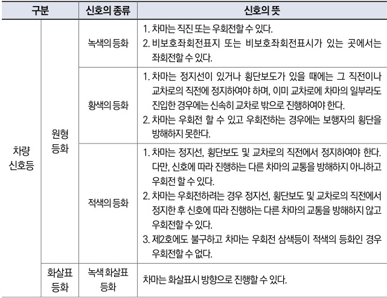

자동차사고 과실비율 인정기준 | 제3편 사고유형별 과실비율 적용기준 199

② 도로를 통행하는 보행자, 차마 또는 노면전차의 운전자는 제1항에 따른 교통안전시설이 표시하는 신호 또는 지시와 교통정리를 하는 경찰공무원 또는 경찰보조자(이하 “경찰공무원 등”이라 한다)의 신호 또는 지시가 서로 다른 경우에는 경찰공무원등의 신호 또는 지시에 따라야 한다.

**⊙도로교통법 제25조(교차로 통행방법)**
② 모든 차의 운전자는 교차로에서 좌회전을 하려는 경우에는 미리 도로의 중앙선을 따라서 행하면서 교차로의 중심 안쪽을 이용하여 좌회전하여야 한다. 다만, 시·도 경찰청장이 교차로의 상황에 따라 특히 필요하다고 인정하여 지정한 곳에서는 교차로의 중심 바깥쪽을 통과할 수 있다.

⑤ 모든 차 또는 노면전차의 운전자는 신호기로 교통정리를 하고 있는 교차로에 들어가려는 경우에는 진행하려는 진로의 앞쪽에 있는 차 또는 노면전차의 상황에 따라 교차로(정지선이 설치되어 있는 경우에는 그 정지선을 넘은 부분을 말한다)에 정지하게 되어 다른 차 또는 노면전차의 통행에 방해가 될 우려가 있는 경우에는 그 교차로에 들어가서는 아니 된다.

**⊙도로교통법 시행규칙 별표2(신호기가 표시하는 신호의 종류 및 신호의 뜻)**

| 구분     | 신호의 종류 | 신호의 뜻     |                                                                                                                                                                                                                                         |
| ------ | ------ | --------- | --------------------------------------------------------------------------------------------------------------------------------------------------------------------------------------------------------------------------------------- |
| 차량 신호등 | 원형 등화  | 녹색의 등화    | 1. 차마는 직진 또는 우회전할 수 있다. 2. 비보호좌회전표지 또는 비보호좌회전표시가 있는 곳에서는 좌회전할 수 있다.                                                                                                                                                                 |
| 차량 신호등 |        | 황색의 등화    | 1. 차마는 정지선이 있거나 횡단보도가 있을 때에는 그 직전이나 교차로의 직전에 정지하여야 하며, 이미 교차로에 차마의 일부라도 진입한 경우에는 신속히 교차로 밖으로 진행하여야 한다. 2. 차마는 우회전 할 수 있고 우회전하는 경우에는 보행자의 횡단을 방해하지 못한다.                                                                              |
| 차량 신호등 |        | 적색의 등화    | 1. 차마는 정지선, 횡단보도 및 교차로의 직전에서 정지하여야 한다. 다만, 신호에 따라 진행하는 다른 차마의 교통을 방해하지 아니하고 우회전 할 수 있다. 2. 차마는 우회전하려는 경우 정지선, 횡단보도 및 교차로의 직전에서 정지한 후 신호에 따라 진행하는 다른 차마의 교통을 방해하지 않고 우회전할 수 있다. 3. 제2호에도 불구하고 차마는 우회전 삼색등이 적색의 등화인 경우 우회전할 수 없다. |
| 차량 신호등 | 화살표 등화 | 녹색 화살표 등화 | 차마는 화살표시 방향으로 진행할 수 있다.                                                                                                                                                                                                                 |

제2장. 자동차와 자동차(이륜차 포함)의 사고
