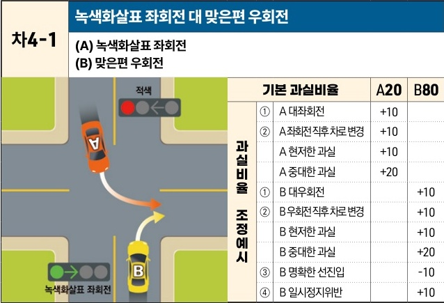

자동차사고 과실비율 인정기준 | 제3편 사고유형별 과실비율 적용기준 206 **목차**

### 4) 좌회전 대 우회전 – 상대차량이 맞은편에서 진입 [차4]

| 차4-1 | 녹색화살표 좌회전 대 맞은편 우회전 (A) 녹색화살표 좌회전(B) 맞은편 우회전 녹색화살표 좌회전 신호에 따라 좌회전하는 A차량과 맞은편 적색신호에 우회전하는 B차량이 교차로 내에서 충돌하는 상황도 | 녹색화살표 좌회전 대 맞은편 우회전 (A) 녹색화살표 좌회전(B) 맞은편 우회전 기본 과실비율 과실비율 조정예시 | 녹색화살표 좌회전 대 맞은편 우회전 (A) 녹색화살표 좌회전(B) 맞은편 우회전 기본 과실비율 ① A 대좌회전 ② A 좌회전 직후 차로 변경 A 현저한 과실 A 중대한 과실 ① B 대우회전 ② B 우회전 직후 차로 변경 B 현저한 과실 B 중대한 과실 | 녹색화살표 좌회전 대 맞은편 우회전 (A) 녹색화살표 좌회전(B) 맞은편 우회전 A20 +10 +10 +10 +20 | 녹색화살표 좌회전 대 맞은편 우회전 (A) 녹색화살표 좌회전(B) 맞은편 우회전 B80+10 +10 +10 +20 |
| ---- | ---------------------------------------------------------------------------------------------------------------------- | -------------------------------------------------------------------------- | ------------------------------------------------------------------------------------------------------------------------------------------------------------------------------------ | ---------------------------------------------------------------------------------------- | ----------------------------------------------------------------------------------- |
|      | ③ B 명확한 선진입                                                                                                            |                                                                            | -10                                                                                                                                                                                  |                                                                                          |                                                                                     |
|      | ④ B 일시정지위반                                                                                                             |                                                                            | +10                                                                                                                                                                                  |                                                                                          |                                                                                     |

※사고발생, 손해확대와의 인과관계를 감안하여 기본 과실비율을 가(+), 감(-) 조정 가능합니다.
※舊 256, 396, 396-1 기준

#### 사고 상황
* 교차로에서 정상신호에 따라 좌회전하는 A차량과 맞은편에서 교차로 적색신호에 우회전하는 B차량이 충돌한 사고이다.

#### 기본 과실비율 해설
* 같은 방향의 차로를 향한 동시진로변경의 성격을 가지는 것이나 좌회전 차량은 좌회전 신호에 따라 진행하고 있어 통행우선권이 있고, 교차로 적색 신호에 우회전 차량은 신호에 따라 진행하는 차량의 교통을 방해하지 않으면서 우회전을 하여야 할 의무가 있다는 점을 감안하여 양 차량의 기본 과실비율을 20:80으로 정한다.

#### 수정요소(인과관계를 감안한 과실비율 조정) 해설
① A가 정상적인 좌회전 궤도로 좌회전하지 않고 정상 궤도를 이탈하여 크게 회전(대좌회전)하는 행위는 우회전 차량으로 하여금 회전반경을 예측하기 어렵게하여 사고위험을 가중하는

제2장. 자동차와 자동차(이륜차 포함)의 사고
