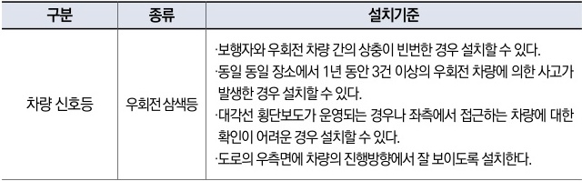

자동차사고 과실비율 인정기준 | 제3편 사고유형별 과실비율 적용기준 209

### ⊙ 도로교통법 시행규칙 별표3(신호등의 종류, 만드는 방식 및 설치기준)

| 구분     | 종류      | 설치기준                                                                                                                                                                                               |
| ------ | ------- | -------------------------------------------------------------------------------------------------------------------------------------------------------------------------------------------------- |
| 차량 신호등 | 우회전 삼색등 | ·보행자와 우회전 차량 간의 상충이 빈번한 경우 설치할 수 있다. ·동일 장소에서 1년 동안 3건 이상의 우회전 차량에 의한 사고가 발생한 경우 설치할 수 있다. ·대각선 횡단보도가 운영되는 경우나 좌측에서 접근하는 차량에 대한 확인이 어려운 경우 설치할 수 있다. ·도로의 우측면에 차량의 진행방향에서 잘 보이도록 설치한다. |

#### <mark>참고 판례</mark>

**⊙ 서울중앙지방법원 2018.4.6. 선고 2017나63155 판결**
A차량은 사거리(十자) 교차로에서 좌회전하던 중 A차량의 조수석 측면 부분이 맞은편 교차로에서 크게 우회전하던 B차량의 앞 범퍼 부분과 충돌, 이때 B차량은 교차로에 주차된 차량을 피해 2차로로 진입하여 우회전함, A차량 20%.

목차
제1장. 자동차와 보행자의 사고
제2장. 자동차와 자동차(이륜차 포함)의 사고
제3장. 자동차와 자전거(농기계 포함)의 사고
