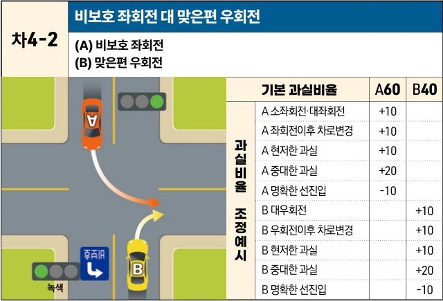

자동차사고 과실비율 인정기준 | 제3편 사고유형별 과실비율 적용기준 210

# 차4-2 비보호 좌회전 대 맞은편 우회전
(A) 비보호 좌회전
(B) 맞은편 우회전

[The image shows a diagram of a four-way intersection. Vehicle A is performing a left turn from a lane with a "비보호" (unprotected) left turn sign under a green light. Vehicle B is performing a right turn from the opposite direction into the same road. The two vehicles are on a collision course.]

| 과실비율 조정예시 | 기본 과실비율      | 기본 과실비율 | A60 | B40 |
| --------- | ------------ | ------- | --- | --- |
| 과실비율 조정예시 | A 소좌회전·대좌회전  | +10     |     |     |
|           | A 좌회전이후 차로변경 | +10     |     |     |
|           | A 현저한 과실     | +10     |     |     |
|           | A 중대한 과실     | +20     |     |     |
|           | A 명확한 선진입    | -10     |     |     |
| 과실비율 조정예시 | B 대우회전       |         | +10 |     |
|           | B 우회전이후 차로변경 |         | +10 |     |
|           | B 현저한 과실     |         | +10 |     |
|           | B 중대한 과실     |         | +20 |     |
|           | B 명확한 선진입    |         | -10 |     |

※사고발생, 손해확대와의 인과관계를 감안하여 기본 과실비율을 가(+), 감(-) 조정 가능합니다.

### 사고 상황
* 신호기에 의해 교통정리가 이루어지고 한쪽 방향에 비보호좌회전 표지가 있는 교차로에서 녹색신호에 비보호좌회전을 하는 A차량과 맞은 편에서 우회전하는 B차량이 충돌한 사고이다.

### 기본 과실비율 해설
* 도로교통법은 비보호좌회전 표지가 설치된 교차로에서 좌회전하려는 차량은 진행신호시 반대방면에서 오는 차량에 방해가 되지 아니하도록 좌회전을 조심스럽게 할 수 있다고 규정하고 있고 교통정리를 하고 있지 아니하는 교차로에서 좌회전하려는 차량은 그 교차로에서 우회전하려는 다른 차가 있을 때에는 그 차에 진로를 양보하여야 한다고 규정하여 우회전 차량에게 진행의 우선권을 인정하고 있다. 다만 우회전하는 차량도 교차로에서 진행하는 다른 차량에 주의하여 진행하여야 하는 점을 고려하여 양 차량의 기본과실을 60:40으로 정하였다.

제2장. 자동차와 자동차(이륜차 포함)의 사고
