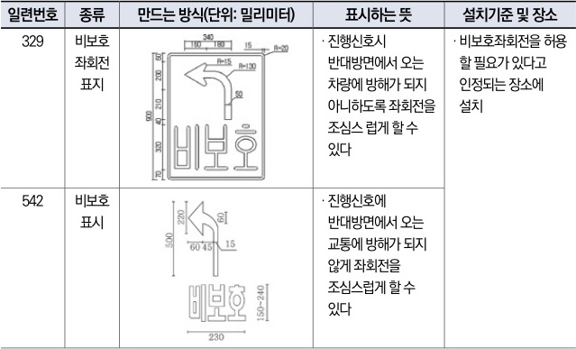

자동차사고 과실비율 인정기준 | 제3편 사고유형별 과실비율 적용기준 212 **목차**

④ 교통정리를 하고 있지 아니하는 교차로에서 좌회전하려고 하는 차의 운전자는 그 교차로에서 직진하거나 우회전하려는 다른 차가 있을 때에는 그 차에 진로를 양보하여야 한다.

**◉ 도로교통법 제31조(서행 또는 일시정지할 장소)**
① 모든 차의 운전자는 다음 각 호의 어느 하나에 해당하는 곳에서는 서행하여야 한다.
1. 교통정리를 하고 있지 아니하는 교차로

**◉ 도로교통법 제38조(차의 신호)**
① 모든 차의 운전자는 좌회전·우회전·횡단·유턴·서행·정지 또는 후진을 하거나 같은 방향으로 진행하면서 진로를 바꾸려고 하는 경우에는 손이나 방향지시기 또는 등화로 그 행위가 끝날 때까지 신호를 하여야 한다.

**◉ 도로교통법 시행규칙 별표6**
**(안전표지의 종류, 만드는 방식, 설치하는 장소·기준 및 표시하는 뜻)**

| 일련번호 | 종류         | 만드는 방식(단위: 밀리미터)                                                                                                                                                                                                                                             | 표시하는 뜻                                               | 설치기준 및 장소                         |
| ---- | ---------- | ------------------------------------------------------------------------------------------------------------------------------------------------------------------------------------------------------------------------------------------------------------ | ---------------------------------------------------- | --------------------------------- |
| 329  | 비보호 좌회전 표지 | \[The image shows a rectangular sign with a blue border. Inside, there is a white left-turn arrow and the Korean text "비보호" (Unprotected) below it. Dimensions are marked: 600x900mm total size, with various internal measurements for the arrow and text.] | · 진행신호시 반대방면에서 오는 차량에 방해가 되지 아니하도록 좌회전을 조심스럽게 할 수 있다 | · 비보호좌회전을 허용할 필요가 있다고 인정되는 장소에 설치 |
| 542  | 비보호 표시     | \[The image shows a road surface marking. It consists of a white left-turn arrow and the Korean text "비보호" (Unprotected) below it. Dimensions are marked: 230x500mm for the main area, with specific spacing for the characters.]                            | · 진행신호에 반대방면에서 오는 교통에 방해가 되지 않게 좌회전을 조심스럽게 할 수 있다    |                                   |

### 참고 판례
**◉ 서울중앙지방법원 2018. 4. 27. 선고 2017나65373 판결**
비보호좌회전하는 구역에서 좌회전하는 차량의 운전자는 반대방향에서 진행신호에 따라 직진하는 차량에 방해가 되지 않도록 유의하여 조심스럽게 좌회전을 할 의무가 있는데, 비보호 좌회전을 하던 A차량이 교차로 맞은편에서 우회전하여 이미 차로에 진입하고 있던 B차량을 충격한 사고인 점 고려하여 판단함. A차량 과실 80%.

제2장. 자동차와 자동차(이륜차 포함)의 사고
