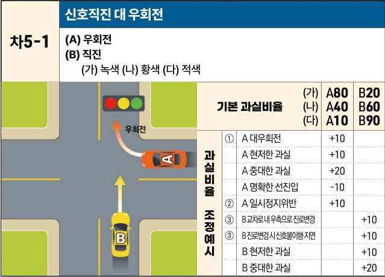

자동차사고 과실비율 인정기준 | 제3편 사고유형별 과실비율 적용기준 213

## (2) 한쪽 신호등 있는 교차로(상대차량이 측면에서 진입)

### 1) 직진 대 우회전 사고 [차5]

| 차5-1                                                                                                                                                                                                                                                                                           | 신호직진 대 우회전 (A) 우회전(B) 직진(가) 녹색 (나) 황색 (다) 적색 | 신호직진 대 우회전 (A) 우회전(B) 직진(가) 녹색 (나) 황색 (다) 적색 | 신호직진 대 우회전 (A) 우회전(B) 직진(가) 녹색 (나) 황색 (다) 적색 | 신호직진 대 우회전 (A) 우회전(B) 직진(가) 녹색 (나) 황색 (다) 적색 | 신호직진 대 우회전 (A) 우회전(B) 직진(가) 녹색 (나) 황색 (다) 적색 | 신호직진 대 우회전 (A) 우회전(B) 직진(가) 녹색 (나) 황색 (다) 적색 |
| ---------------------------------------------------------------------------------------------------------------------------------------------------------------------------------------------------------------------------------------------------------------------------------------------- | ------------------------------------------------ | ------------------------------------------------ | ------------------------------------------------ | ------------------------------------------------ | ------------------------------------------------ | ------------------------------------------------ |
| \[The image shows a diagram of a T-junction intersection. Vehicle B is traveling straight through the intersection with a green traffic light. Vehicle A is entering from the right side road, which has no traffic light, and is attempting to make a right turn into the path of Vehicle B.] | 기본 과실비율                                          | (가)                                              |                                                  | A80                                              | B20                                              |                                                  |
|                                                                                                                                                                                                                                                                                                |                                                  | (나)                                              |                                                  | A40                                              | B60                                              |                                                  |
|                                                                                                                                                                                                                                                                                                |                                                  | (다)                                              |                                                  | A10                                              | B90                                              |                                                  |
|                                                                                                                                                                                                                                                                                                | 과실비율 조정예시 ①                                      | A 대우회전                                           |                                                  | +10                                              |                                                  |                                                  |
|                                                                                                                                                                                                                                                                                                |                                                  | A 현저한 과실                                         |                                                  | +10                                              |                                                  |                                                  |
|                                                                                                                                                                                                                                                                                                |                                                  | A 중대한 과실                                         |                                                  | +20                                              |                                                  |                                                  |
|                                                                                                                                                                                                                                                                                                |                                                  | A 명확한 선진입                                        |                                                  | -10                                              |                                                  |                                                  |
|                                                                                                                                                                                                                                                                                                |                                                  | ②                                                | A 일시정지위반                                         |                                                  | +10                                              |                                                  |
|                                                                                                                                                                                                                                                                                                |                                                  | ③                                                | B 교차로 내 우측으로 진로변경                                |                                                  |                                                  | +10                                              |
|                                                                                                                                                                                                                                                                                                |                                                  | ③                                                | B 진로변경 시 신호불이행·지연                                |                                                  |                                                  | +10                                              |
|                                                                                                                                                                                                                                                                                                |                                                  | B 현저한 과실                                         |                                                  |                                                  | +10                                              |                                                  |
| B 중대한 과실                                                                                                                                                                                                                                                                                       |                                                  |                                                  | +20                                              |                                                  |                                                  |                                                  |

※사고발생, 손해확대와의 인과관계를 감안하여 기본 과실비율을 가(+), 감(-) 조정 가능합니다.
※舊 228 기준

### 사고 상황
* 신호기에 의한 교통정리가 한쪽 방향에만 이루어지고 있는 교차로에서 신호기가 없는 도로를 이용하여 우회전하는 A차량과 신호기가 있는 교차도로를 이용하여 직진하는 B차량이 충돌한 사고이다.

### 기본 과실비율 해설
* <mark>(가)</mark> B차량이 녹색신호에 직진한 경우에는 A차량에 대하여 통행우선권이 있으나, A차량이 진행한 방향에는 신호기가 없으므로 신호위반의 과실을 묻기 어렵고, B차량은 이러한 교차로를 통과함에 있어 전방좌우를 철저히 살피고 안전운전을 해야 할 주의의무가 있으므로 양 차량의 기본 과실비율을 80:20으로 정한다. A차량 전방 교차로 신호기가 있고 적색일 때 우회전하는 경우에도 마찬가지이다.

제2장. 자동차와 자동차(이륜차 포함)의 사고
