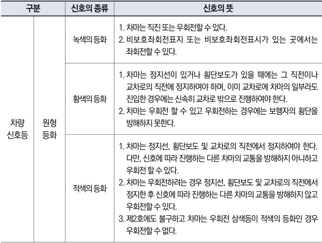

자동차사고 과실비율 인정기준 | 제3편 사고유형별 과실비율 적용기준 224

### ⊙ 도로교통법 시행규칙 별표2(신호기가 표시하는 신호의 종류 및 신호의 뜻)

| 구분         | 신호의 종류    | 신호의 뜻  |                                                                         |                                                                                                                                                                                                                                         |
| ---------- | --------- | ------ | ----------------------------------------------------------------------- | --------------------------------------------------------------------------------------------------------------------------------------------------------------------------------------------------------------------------------------- |
| 차량 신호등 | 원형 등화 | 녹색의 등화 | 1. 차마는 직진 또는 우회전할 수 있다. 2. 비보호좌회전표지 또는 비보호좌회전표시가 있는 곳에서는 좌회전할 수 있다. |                                                                                                                                                                                                                                         |
|            |           |        | 황색의 등화                                                                  | 1. 차마는 정지선이 있거나 횡단보도가 있을 때에는 그 직전이나 교차로의 직전에 정지하여야 하며, 이미 교차로에 차마의 일부라도 진입한 경우에는 신속히 교차로 밖으로 진행하여야 한다. 2. 차마는 우회전 할 수 있고 우회전하는 경우에는 보행자의 횡단을 방해하지 못한다.                                                                              |
|            |           |        | 적색의 등화                                                                  | 1. 차마는 정지선, 횡단보도 및 교차로의 직전에서 정지하여야 한다. 다만, 신호에 따라 진행하는 다른 차마의 교통을 방해하지 아니하고 우회전 할 수 있다. 2. 차마는 우회전하려는 경우 정지선, 횡단보도 및 교차로의 직전에서 정지한 후 신호에 따라 진행하는 다른 차마의 교통을 방해하지 않고 우회전할 수 있다. 3. 제2호에도 불구하고 차마는 우회전 삼색등이 적색의 등화인 경우 우회전할 수 없다. |

### <mark>참고 판례</mark>

#### ⊙ 인천지방법원 1993. 12. 24. 선고 93나5567 판결 (기준 (가) 관련)
주간에 편도3차로 도로(신호기 있음)와 주택가 소로(신호기 없음)가 교차하는 사거리(十자) 교차로에서, A차량이 왼쪽 소로에서 도로를 가로질러 직진하기 위해 서서히 교차로를 진입하던 중 도로의 신호상태와 도로를 진행하는 다른 차량의 유무 및 동태를 잘 살피지 아니한 과실로, B이륜차가 오른쪽 도로에서 소로에서 나오는 A차량을 확인하지 아니한 채 신호기의 신호만을 믿고 직진하다가 충돌한 사고. A 좌측에서 좌에서 우로 직진 95%, 우측에서 B이륜차 직진 과실 5%

#### ⊙ 대법원 2002. 9. 6. 선고 2002다38767 판결(기준 (다) 관련)
신호등에 의하여 교통정리가 행하여지는 교차로를 진행신호에 따라 진행하는 차량의 운전자는 특별한 사정이 없는 한 다른 차량들도 교통법규를 준수하고 충돌을 피하기 위하여 적절한 조치를 취할 것으로 믿고 운전하면 되고, 다른 차량이 신호를 위반하고 자신의 진로를 가로질러 진행하여 올 경우까지 예상하여 그에 따른 사고 발생을 미리 방지할 특별한 조치까지 강구할

제2장. 자동차와 자동차(이륜차 포함)의 사고
