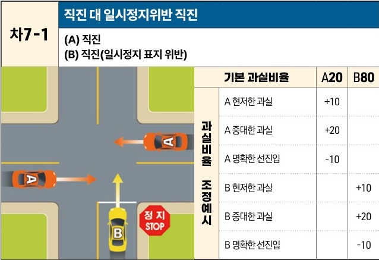

자동차사고 과실비율 인정기준 | 제3편 사고유형별 과실비율 적용기준 226 목차

# (3) 한쪽 지시표지 있는 교차로

## 1) 직진 대 직진 [차7]

| 차7-1                                                                                             | 차7-1      | 차7-1      | 직진 대 일시정지위반 직진(A) 직진(B) 직진(일시정지 표지 위반) | 직진 대 일시정지위반 직진(A) 직진(B) 직진(일시정지 표지 위반) |
| ------------------------------------------------------------------------------------------------ | --------- | --------- | -------------------------------------- | -------------------------------------- |
| 사고 상황 이미지: 신호등 없는 교차로에서 A차량은 직진 중이고, B차량은 '정지 STOP' 표지가 있는 도로에서 직진하여 충돌하는 상황 | 기본 과실비율   | A20       | B80                                    |                                        |
|                                                                                                  | 과실비율 조정예시 | A 현저한 과실  | +10                                    |                                        |
|                                                                                                  |           | A 중대한 과실  | +20                                    |                                        |
|                                                                                                  |           | A 명확한 선진입 | -10                                    |                                        |
|                                                                                                  |           | B 현저한 과실  |                                        | +10                                    |
|                                                                                                  |           | B 중대한 과실  |                                        | +20                                    |
|                                                                                                  |           | B 명확한 선진입 |                                        | -10                                    |

※사고발생, 손해확대와의 인과관계를 감안하여 기본 과실비율을 가(+), 감(-) 조정 가능합니다.
※舊 207, 310, 311 기준

### 사고 상황
* 신호기에 의해 교통정리가 이루어지고 있지 않고 한쪽에 일시정지 표지가 있는 교차로에서 일시정지 표지가 없는 도로를 이용해 교차로에 진입하여 직진 중인 A차량과 일시정지 표지가 있는 도로를 이용해 교차로에 진입하여 직진 중인 B차량이 충돌한 사고이다.

### 기본 과실비율 해설
* 도로교통법 제25조 제6항에 따라 일시정지 표지가 있는 곳에서는 일시정지를 할 의무가 있어 이를 위반한 B차량의 과실이 중하지만, 신호기 없는 교차로를 진행하는 A차량도 도로교통법 제31조에 따라 서행 또는 일시정지를 준수하고 다른 차량의 유무와 동태를 살피면서 진행하여야 할 주의의무가 있다는 점을 고려하여 양 차량의 기본 과실비율을 20:80으로 정한다.

제2장. 자동차와 자동차(이륜차 포함)의 사고
