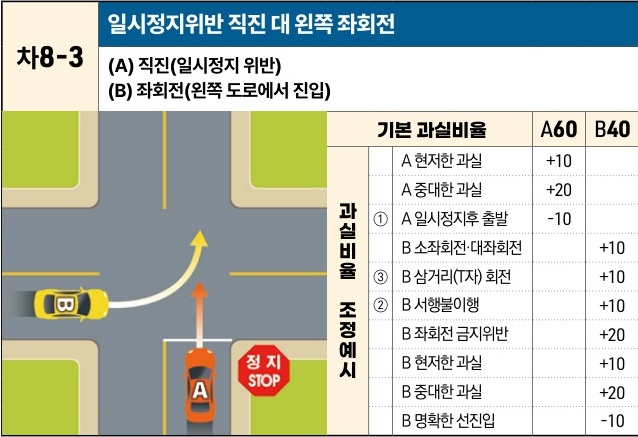

자동차사고 과실비율 인정기준 | 제3편 사고유형별 과실비율 적용기준 237

# 차8-3 일시정지위반 직진 대 왼쪽 좌회전
(A) 직진(일시정지 위반)
(B) 좌회전(왼쪽 도로에서 진입)

[The image shows a diagram of a T-junction intersection. Vehicle A is on a road with a "정지 STOP" sign, intending to go straight. Vehicle B is approaching from the left road and turning left into the road Vehicle A is on. An orange arrow indicates Vehicle A's path, and a yellow arrow indicates Vehicle B's path.]

| 과실비율 조정예시      | 기본 과실비율      | A60 | B40 |
| -------------- | ------------ | --- | --- |
| 과실비율 조정예시      | A 현저한 과실     | +10 |     |
|                | A 중대한 과실     | +20 |     |
|                | ① A 일시정지후 출발 | -10 |     |
|                | B 소좌회전·대좌회전  |     | +10 |
| ③ B 삼거리(T자) 회전 |              | +10 |     |
| ② B 서행불이행      |              | +10 |     |
|                | B 좌회전 금지위반   |     | +20 |
|                | B 현저한 과실     |     | +10 |
|                | B 중대한 과실     |     | +20 |
|                | B 명확한 선진입    |     | -10 |

※사고발생, 손해확대와의 인과관계를 감안하여 기본 과실비율을 가(+), 감(-) 조정 가능합니다.
※舊 227, 240-227CO, 342, 343, 372-343CO, 373-342CO 기준

## 사고 상황
* 신호기에 의해 교통정리가 이루어지고 있지 않고 한쪽에 일시정지 표지가 있는 교차로에서 일시정지의무를 위반하여 직진하는 A차량과 A차량의 진행방향 왼쪽 도로에서 진입하여 좌회전하는 B차량이 충돌한 사고이다.

## 기본 과실비율 해설
* 일시정지의무를 위반한 직진차량이 오른쪽에서 진입한 경우에는 도로교통법 제26조 제3항을 감안하여 직진차량인 A차량의 비율을 차8-2 대비 10% 낮추어 양 차량의 기본 과실비율을 60:40으로 정하였다.

## 수정요소(인과관계를 감안한 과실비율 조정) 해설
① 직진차량이 일시정지를 하였으나 좌우의 안전 확인이 불충분했던 경우이다. 직진차량이 일시 정지한 경우에는 좌회전차량과 충돌을 회피할 여지가 크므로 직진차량인 A차량의 과실을 감산할 수 있다.

제2장. 자동차와 자동차(이륜차 포함)의 사고
