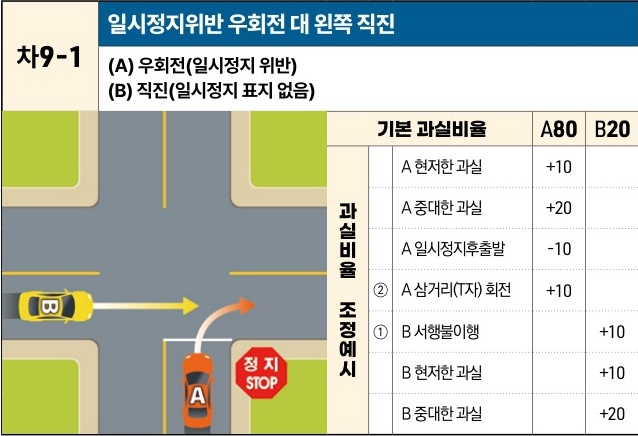

자동차사고 과실비율 인정기준 | 제3편 사고유형별 과실비율 적용기준 240 **목차**

### 3) 직진 대 우회전 [차9]

| 차9-1                                                                                                                                                                                              | 일시정지위반 우회전 대 왼쪽 직진 (A) 우회전(일시정지 위반)(B) 직진(일시정지 표지 없음) | 일시정지위반 우회전 대 왼쪽 직진 (A) 우회전(일시정지 위반)(B) 직진(일시정지 표지 없음) | 일시정지위반 우회전 대 왼쪽 직진 (A) 우회전(일시정지 위반)(B) 직진(일시정지 표지 없음) | 일시정지위반 우회전 대 왼쪽 직진 (A) 우회전(일시정지 위반)(B) 직진(일시정지 표지 없음) | 일시정지위반 우회전 대 왼쪽 직진 (A) 우회전(일시정지 위반)(B) 직진(일시정지 표지 없음) |
| ------------------------------------------------------------------------------------------------------------------------------------------------------------------------------------------------- | --------------------------------------------------------- | --------------------------------------------------------- | --------------------------------------------------------- | --------------------------------------------------------- | --------------------------------------------------------- |
| \[The image shows a T-junction intersection. Vehicle A is at a "STOP" (정지) sign, attempting to turn right. Vehicle B is approaching from the left, proceeding straight through the intersection.] | 기본 과실비율                                                   |                                                           | A80                                                       | B20                                                       |                                                           |
|                                                                                                                                                                                                   | 과실비율 조정예시                                                 | A 현저한 과실                                                  | +10                                                       |                                                           |                                                           |
|                                                                                                                                                                                                   |                                                           | A 중대한 과실                                                  | +20                                                       |                                                           |                                                           |
|                                                                                                                                                                                                   |                                                           | A 일시정지후출발                                                 | -10                                                       |                                                           |                                                           |
|                                                                                                                                                                                                   |                                                           | ②                                                         | A 삼거리(T자) 회전                                              | +10                                                       |                                                           |
|                                                                                                                                                                                                   |                                                           | ①                                                         | B 서행불이행                                                   |                                                           | +10                                                       |
|                                                                                                                                                                                                   |                                                           | B 현저한 과실                                                  |                                                           | +10                                                       |                                                           |
|                                                                                                                                                                                                   |                                                           | B 중대한 과실                                                  |                                                           | +20                                                       |                                                           |

※사고발생, 손해확대와의 인과관계를 감안하여 기본 과실비율을 가(+), 감(-) 조정 가능합니다.
※舊 232, 240-232CO, 354, 355, 372-355CO, 373-354CO 기준

#### 사고 상황
* 신호기에 의해 교통정리가 이루어지고 있지 않고 한쪽에 일시정지 표지가 있는 교차로에서 일시정지 표지를 위반하여 우회전하는 A차량과 일시정지 표지가 없는 도로에서 직진하는 B차량이 충돌한 사고이다.

#### 기본 과실비율 해설
* 도로교통법 제25조 제6항에 따라 일시정지 표지가 있는 곳에서는 일시정지 의무가 있으므로 이를 위반한 우회전 A차량의 과실이 중하지만, 동법 제31조에 따라 B차량도 교차로 진입 시 서행 또는 일시정지하여 전방 및 좌우를 살피면서 진행하여야 할 주의의무가 있다는 점을 감안하여 양 차량의 기본 과실비율을 80:20으로 정한다.

제2장. 자동차와 자동차(이륜차 포함)의 사고
