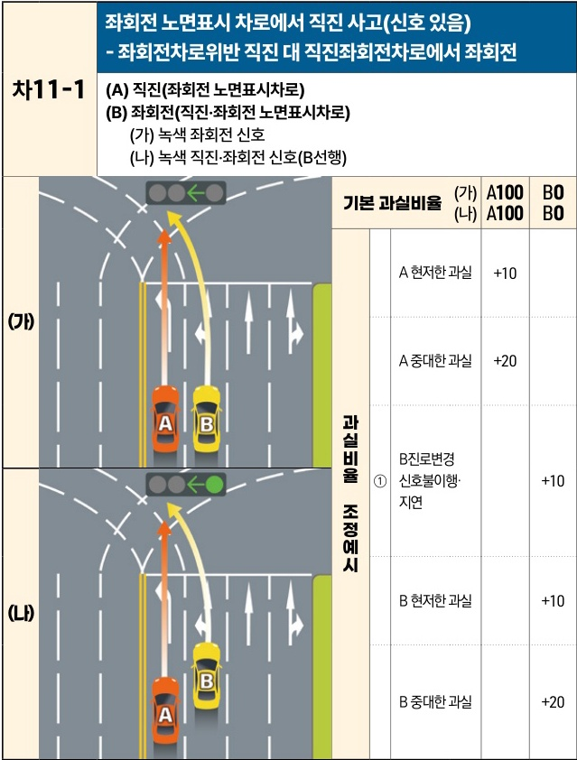

자동차사고 과실비율 인정기준 | 제3편 사고유형별 과실비율 적용기준 249 **목차**

# (4) 교차로 노면 표시 위반 사고 [차11]

| 차11-1 (A) 직진(좌회전 노면표시차로)(B) 좌회전(직진·좌회전 노면표시차로)(가) 녹색 좌회전 신호(나) 녹색 직진·좌회전 신호(B선행) | 차11-1 (A) 직진(좌회전 노면표시차로)(B) 좌회전(직진·좌회전 노면표시차로)(가) 녹색 좌회전 신호(나) 녹색 직진·좌회전 신호(B선행)                                                                                                                                                                                                                                                        | 차11-1 (A) 직진(좌회전 노면표시차로)(B) 좌회전(직진·좌회전 노면표시차로)(가) 녹색 좌회전 신호(나) 녹색 직진·좌회전 신호(B선행) | 차11-1 (A) 직진(좌회전 노면표시차로)(B) 좌회전(직진·좌회전 노면표시차로)(가) 녹색 좌회전 신호(나) 녹색 직진·좌회전 신호(B선행) | 좌회전 노면표시 차로에서 직진 사고(신호 있음)- 좌회전차로위반 직진 대 직진·좌회전차로에서 좌회전 (A) 직진(좌회전 노면표시차로)(B) 좌회전(직진·좌회전 노면표시차로)(가) 녹색 좌회전 신호(나) 녹색 직진·좌회전 신호(B선행) | 좌회전 노면표시 차로에서 직진 사고(신호 있음)- 좌회전차로위반 직진 대 직진·좌회전차로에서 좌회전 (A) 직진(좌회전 노면표시차로)(B) 좌회전(직진·좌회전 노면표시차로)(가) 녹색 좌회전 신호(나) 녹색 직진·좌회전 신호(B선행) |
| ------------------------------------------------------------------------------------ | ------------------------------------------------------------------------------------------------------------------------------------------------------------------------------------------------------------------------------------------------------------------------------------------------------------------------------------------- | ------------------------------------------------------------------------------------ | ------------------------------------------------------------------------------------ | -------------------------------------------------------------------------------------------------------------------------------------- | -------------------------------------------------------------------------------------------------------------------------------------- |
| (가)                                                                                  | \[The image shows two scenarios (가) and (나) at a multi-lane intersection. In (가), car A is in a left-turn only lane and goes straight while car B is in a straight/left-turn lane and turns left under a green left-turn arrow. In (나), the same movement occurs under a green light for both straight and left turns, with B preceding A.] | 기본 과실비율                                                                              | (가) A100 B0 (나) A100 B0                                                          |                                                                                                                                        |                                                                                                                                        |
|                                                                                      |                                                                                                                                                                                                                                                                                                                                             | 과실비율 조정예시                                                                            | A 현저한 과실                                                                             | +10                                                                                                                                    |                                                                                                                                        |
|                                                                                      |                                                                                                                                                                                                                                                                                                                                             |                                                                                      | A 중대한 과실                                                                             | +20                                                                                                                                    |                                                                                                                                        |
|                                                                                      |                                                                                                                                                                                                                                                                                                                                             |                                                                                      | ①                                                                                    | B진로변경 신호불이행·지연                                                                                                                         | +10                                                                                                                                    |
|                                                                                      |                                                                                                                                                                                                                                                                                                                                             |                                                                                      |                                                                                      | (나)                                                                                                                                    |                                                                                                                                        |
| B 현저한 과실                                                                             |                                                                                                                                                                                                                                                                                                                                             |                                                                                      | +10                                                                                  |                                                                                                                                        |                                                                                                                                        |
| B 중대한 과실                                                                             |                                                                                                                                                                                                                                                                                                                                             |                                                                                      | +20                                                                                  |                                                                                                                                        |                                                                                                                                        |

※사고발생, 손해확대와의 인과관계를 감안하여 기본 과실비율을 가(+), 감(-) 조정 가능합니다.
※舊 258, 398 기준

제2장. 자동차와 자동차(이륜차 포함)의 사고
