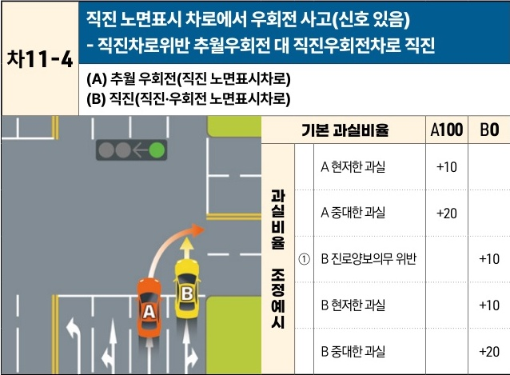

자동차사고 과실비율 인정기준 | 제3편 사고유형별 과실비율 적용기준 258 **목차**

| 차11-4                                                           | 직진 노면표시 차로에서 우회전 사고(신호 있음) - 직진차로위반 추월우회전 대 직진우회전차로 직진 |
| --------------------------------------------------------------- | ---------------------------------------------------------- |
| \*\*(A) 추월 우회전(직진 노면표시차로)\*\* \*\*(B) 직진(직진·우회전 노면표시차로)\*\* |                                                            |

[The image shows a traffic accident diagram at an intersection with a green light. Vehicle A is in a lane marked with a straight-ahead arrow but is attempting to turn right, overtaking Vehicle B. Vehicle B is in the rightmost lane marked with both straight-ahead and right-turn arrows and is proceeding straight. A collision occurs as Vehicle A turns across Vehicle B's path.]

| 기본 과실비율    | 기본 과실비율 | 기본 과실비율     | A100     | B0  |     |
| ---------- | ------- | ----------- | -------- | --- | --- |
| 과실비율 조정 예시 | A       | A 현저한 과실    | +10      |     |     |
|            |         |             | A 중대한 과실 | +20 |     |
|            | ① B     | B 진로양보의무 위반 |          | +10 |     |
|            |         |             | B 현저한 과실 |     | +10 |
|            |         |             | B 중대한 과실 |     | +20 |

※사고발생, 손해확대와의 인과관계를 감안하여 기본 과실비율을 가(+), 감(-) 조정 가능합니다.
※舊 260, 398-2 기준

### 사고 상황
* 신호기 등에 의하여 교통정리가 이루어지는 교차로에서 직진 녹색신호에 후행하던 A차량이 직진노면표시 차로에서 추월하여 우회전 하던 중 직진 및 우회전 노면표시가 된 오른쪽 차로에서 직진하던 B차량과 충돌한 사고이다.

### 기본 과실비율 해설
* A차량은 도로교통법 제25조 제1항의 교차로 통행방법을 위반하였고, 직진 노면표시 차로에서 우회전하여 중대한 안전운전 불이행의 과실이 있으며, 도로교통법 제22조의 앞지르기 금지의 시기 및 장소를 위반한 점을 고려 기본 과실비율을 100:0으로 본다.

### 수정요소(인과관계를 감안한 과실비율 조정) 해설
① 도로교통법 제20조 진로양보의무에 따라 피추월차량은 추월차량보다 계속하여 느리게 진행하고자 할 때에는 도로 오른쪽으로 피하여 진로를 양보하여야 할 의무가 있으므로,

제2장. 자동차와 자동차(이륜차 포함)의 사고
