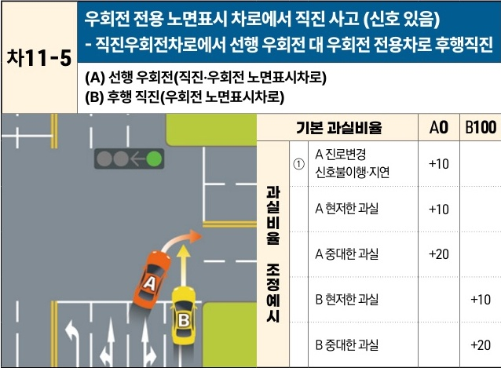

자동차사고 과실비율 인정기준 | 제3편 사고유형별 과실비율 적용기준 261

| 차11-5                                                               | 우회전 전용 노면표시 차로에서 직진 사고 (신호 있음) - 직진우회전차로에서 선행 우회전 대 우회전 전용차로 후행직진 |
| ------------------------------------------------------------------- | --------------------------------------------------------------------- |
| \*\*(A) 선행 우회전(직진·우회전 노면표시차로)\*\* \*\*(B) 후행 직진(우회전 노면표시차로)\*\* |                                                                       |

| 기본 과실비율A 현저한 과실 +10 A 중대한 과실 +20 B 현저한 과실 B 중대한 과실 | A0 과실비율 조정 예시 ① A 진로변경 신호불이행·지연 +10 | A0 과실비율 조정 예시 ① A 진로변경 신호불이행·지연 +10 | B100A 현저한 과실 +10 A 중대한 과실 +20 +10 +20 | B100+10 +20 |
| -------------------------------------------------------------- | --------------------------------------- | --------------------------------------- | ------------------------------------------------- | --------------- |

※사고발생, 손해확대와의 인과관계를 감안하여 기본 과실비율을 가(+), 감(-) 조정 가능합니다.
※舊 261 기준

### 사고 상황
* 신호기에 의하여 교통정리가 이루어지고 있는 교차로에서 직진 신호에 따라 직진 및 우회전 노면표시가 된 차로에서 선행 우회전을 하는 A차량과 우회전 노면표시가 된 오른쪽 차로에서 후행 직진하는 B차량이 충돌한 사고이다.

### 기본 과실비율 해설
* B차량이 우회전 노면표시 차로에서 직진하여 중대한 안전운전 불이행의 과실이 있으며, B차량의 주행차로가 교차로 이후 차로가 감소하여 교차로 내 차로변경 없이 직진이 현실적으로 불가능한 점 등을 고려할 때, 교차로 내에서 무리하게 직진한 B차량의 일방과실로 보아 기본 과실비율을 0 : 100으로 정한다.

제2장. 자동차와 자동차(이륜차 포함)의 사고
