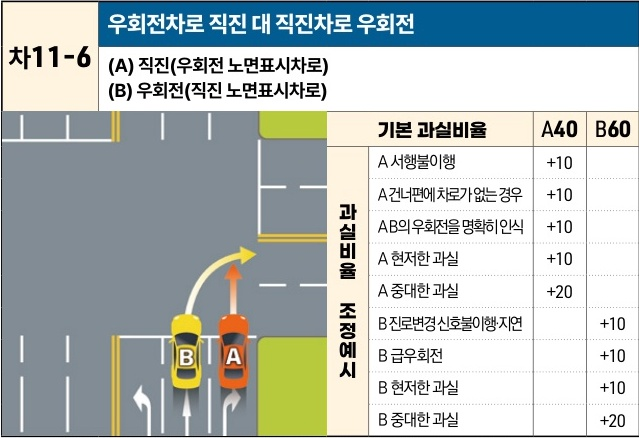

자동차사고 과실비율 인정기준 | 제3편 사고유형별 과실비율 적용기준 264

| 차11-6                                                     | 우회전차로 직진 대 직진차로 우회전 |     |     |
| --------------------------------------------------------- | ------------------- | --- | --- |
| \*\*(A) 직진(우회전 노면표시차로)\*\* \*\*(B) 우회전(직진 노면표시차로)\*\* |                     |     |     |
|                                                           |                     |     |     |
| 과실비율 조정예시                                                 | 기본 과실비율             | A40 | B60 |
| A 서행불이행                                                   | +10                 |     |     |
| A 건너편에 차로가 없는 경우                                          | +10                 |     |     |
| A B의 우회전을 명확히 인식                                          | +10                 |     |     |
| A 현저한 과실                                                  | +10                 |     |     |
| A 중대한 과실                                                  | +20                 |     |     |
| B 진로변경신호불이행·지연                                            |                     | +10 |     |
| B 급우회전                                                    |                     | +10 |     |
| B 현저한 과실                                                  |                     | +10 |     |
| B 중대한 과실                                                  |                     | +20 |     |

※사고발생, 손해확대와의 인과관계를 감안하여 기본 과실비율을 가(+), 감(-) 조정 가능합니다.

### 사고 상황
* 신호기에 의하여 교통정리가 이루어지고 있지 않은 교차로에서 직진 노면표시가 된 2차로에서 우회전하는 B차량과 우회전 노면표시가 된 3차로에서 직진하는 A차량이 충돌한 사고이다.
* 신호기에 의하여 교통정리가 이루어지고 있는 교차로에서 직진 신호가 등화된 상태에서 발생한 사고의 경우에도 준용할 수 있다.

### 기본 과실비율 해설
* 노면에 진행방향표시가 설치된 차로의 경우 차량의 운전자는 지정한 통행방법에 따라 통행하여야 할 주의의무를 부담하므로 우회전표지가 설치된 차로에서 직진한 A차량과 직진표지가 설치된 차로에서 우회전한 B차량은 모두 지정된 통행방법에 따라 진행하지 아니한 과실이 인정된다. 다만 직진표지가 설치된 차로에서 우회전한 B차량은 도로의 우측 가장자리를 따라 우회전하여야 하는 교차로통행방법을 위반한 채 우측차로를 가로지르는 방식으로 급회전한 과실이 인정되는 점을 고려하여 양 차량의 기본 과실비율을 40:60으로 정하였다.

제2장. 자동차와 자동차(이륜차 포함)의 사고
