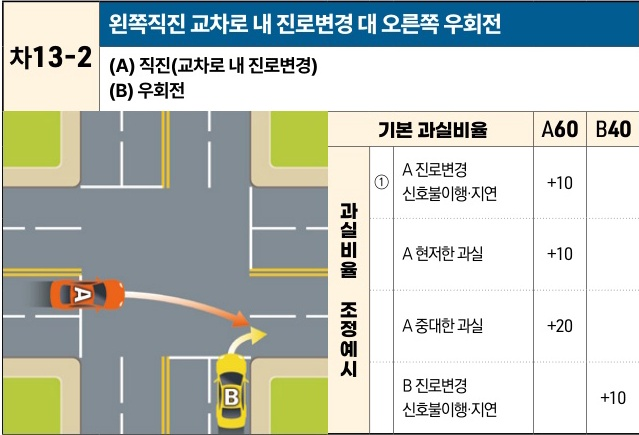

자동차사고 과실비율 인정기준 | 제3편 사고유형별 과실비율 적용기준 277

| 차13-2                                                                                                                                                                                                                                                                                                                      | 왼쪽직진 교차로 내 진로변경 대 오른쪽 우회전      |     |     |
| -------------------------------------------------------------------------------------------------------------------------------------------------------------------------------------------------------------------------------------------------------------------------------------------------------------------------- | ------------------------------ | --- | --- |
|                                                                                                                                                                                                                                                                                                                            | (A) 직진(교차로 내 진로변경) (B) 우회전 |     |     |
| \[The image shows a diagram of a four-way intersection without traffic lights. Car A (orange) is traveling straight from the left in the first lane and changes lanes to the second lane within the intersection. Car B (yellow) is turning right from the bottom road into the same second lane, leading to a collision.] | 기본 과실비율                        | A60 | B40 |
| 과실비율 조정예시                                                                                                                                                                                                                                                                                                                  | ① A 진로변경 신호불이행·지연              | +10 |     |
| A 현저한 과실                                                                                                                                                                                                                                                                                                                   | +10                            |     |     |
| A 중대한 과실                                                                                                                                                                                                                                                                                                                   | +20                            |     |     |
| B 진로변경 신호불이행·지연                                                                                                                                                                                                                                                                                                            |                                | +10 |     |

※사고발생, 손해확대와의 인과관계를 감안하여 기본 과실비율을 가(+), 감(-) 조정 가능합니다.
※舊 233-1, 348-1, 349-1 기준

### 사고 상황
◉ 신호기에 의해 교통정리가 이루어지고 있지 않은 교차로에서 1차로를 따라 직진하다가 교차로 내에서 2차로로 진로변경을 하는 A차량과 A차량의 진행방향 우측도로에서 우회전을 하는 B차량이 충돌한 사고이다.

### 기본 과실비율 해설
◉ A차량은 전방 신호에 의하여 보호받지 못한 채 교차로에 진입하여 직진하다가 진로변경을 하였다는 점, 직진차량이 모든 차로를 우회전차량보다 우선적으로 통행할 수 있다고 볼 근거는 없으며 B차량으로서는 좌측 도로에서 1차로를 따라 직진 중인 A차량이 2차로로 진로변경을 할 것까지 대비하기는 어렵다는 점, 도로교통법 제26조 제3항의 해석상 B차량이 A차량의 우측도로에서 교차로에 진입하고 있으므로 B차량에게 통행우선권이 있다고 볼 수 있는 점을 종합하면, A차량의 과실이 B차량보다 더 크다고 보아야 할 것이다. 다만, B차량도 교차로 진입 전에 전방 좌측에서 직진중인 A차량을 발견하고 그 진로를 계속 예의주시하면서 안전하게 우회전을 하여야 할 주의의무가 있다는 점을 고려할 때, 양 차량의 기본 과실비율을 60:40으로 정하였다.

제2장. 자동차와 자동차(이륜차 포함)의 사고
