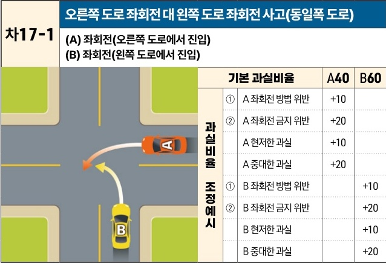

자동차사고 과실비율 인정기준 | 제3편 사고유형별 과실비율 적용기준 304

## 6) 좌회전 대 좌회전 [차17]

| 차17-1 오른쪽 도로 좌회전 대 왼쪽 도로 좌회전 사고(동일폭 도로) (A) 좌회전(오른쪽 도로에서 진입)(B) 좌회전(왼쪽 도로에서 진입)                                                                                                                                                                                                                                               | 차17-1 오른쪽 도로 좌회전 대 왼쪽 도로 좌회전 사고(동일폭 도로) (A) 좌회전(오른쪽 도로에서 진입)(B) 좌회전(왼쪽 도로에서 진입) | 차17-1 오른쪽 도로 좌회전 대 왼쪽 도로 좌회전 사고(동일폭 도로) (A) 좌회전(오른쪽 도로에서 진입)(B) 좌회전(왼쪽 도로에서 진입) | 차17-1 오른쪽 도로 좌회전 대 왼쪽 도로 좌회전 사고(동일폭 도로) (A) 좌회전(오른쪽 도로에서 진입)(B) 좌회전(왼쪽 도로에서 진입) | 차17-1 오른쪽 도로 좌회전 대 왼쪽 도로 좌회전 사고(동일폭 도로) (A) 좌회전(오른쪽 도로에서 진입)(B) 좌회전(왼쪽 도로에서 진입) |
| --------------------------------------------------------------------------------------------------------------------------------------------------------------------------------------------------------------------------------------------------------------------------------------------------------------------------------- | ----------------------------------------------------------------------------------- | ----------------------------------------------------------------------------------- | ----------------------------------------------------------------------------------- | ----------------------------------------------------------------------------------- |
| \[The image shows a diagram of a four-way intersection with no traffic lights. Car A (orange) is entering from the right road and turning left. Car B (yellow) is entering from the bottom road (which is to the left of Car A's original direction) and also turning left. Their paths intersect in the middle of the junction.] | 기본 과실비율                                                                             |                                                                                     | A40                                                                                 | B60                                                                                 |
|                                                                                                                                                                                                                                                                                                                                   | 과실비율 조정예시                                                                           | ① A 좌회전 방법 위반                                                                       | +10                                                                                 |                                                                                     |
|                                                                                                                                                                                                                                                                                                                                   |                                                                                     | ② A 좌회전 금지 위반                                                                       | +20                                                                                 |                                                                                     |
|                                                                                                                                                                                                                                                                                                                                   |                                                                                     | A 현저한 과실                                                                            | +10                                                                                 |                                                                                     |
|                                                                                                                                                                                                                                                                                                                                   |                                                                                     | A 중대한 과실                                                                            | +20                                                                                 |                                                                                     |
|                                                                                                                                                                                                                                                                                                                                   |                                                                                     | ① B 좌회전 방법 위반                                                                       |                                                                                     | +10                                                                                 |
|                                                                                                                                                                                                                                                                                                                                   |                                                                                     | ② B 좌회전 금지 위반                                                                       |                                                                                     | +20                                                                                 |
|                                                                                                                                                                                                                                                                                                                                   |                                                                                     | B 현저한 과실                                                                            |                                                                                     | +10                                                                                 |
|                                                                                                                                                                                                                                                                                                                                   |                                                                                     | B 중대한 과실                                                                            |                                                                                     | +20                                                                                 |

※사고발생, 손해확대와의 인과관계를 감안하여 기본 과실비율을 가(+), 감(-) 조정 가능합니다.
※舊 234, 241-234CO, 358, 359, 374-358CO, 375-359CO 기준

### 사고 상황
* 신호기에 의해 교통정리가 이루어지고 있지 않는 동일 폭의 교차로에서 좌회전하는 A차량과 A차량의 진행방향 왼쪽 도로에서 좌회전 진입하는 B차량이 충돌한 사고이다.

### 기본 과실비율 해설
* 신호기가 없는 동일 폭의 교차로에서 동시 좌회전 진입한 경우 도로교통법 제26조 제3항에 따라 오른쪽 도로에서 진입한 A차량에게 통행우선권이 있으나 A차량도 동법 제25조 제2항 및 제31조에 따라 교차로 진입 전 서행 또는 일시정지를 준수하고 전방·좌·우를 주의해야 하는 의무가 있어 이를 고려 양 차량의 기본 과실비율을 40:60으로 정한다.

### 수정요소(인과관계를 감안한 과실비율 조정) 해설
① 도로교통법 제25조 제2항에 따라 좌회전차량은 미리 도로의 중앙선을 따라 서행하면서 교차로의 중심 안쪽을 이용하여 좌회전하여야 하고, 동법 제38조 제1항에 따라 좌회전을

제2장. 자동차와 자동차(이륜차 포함)의 사고
