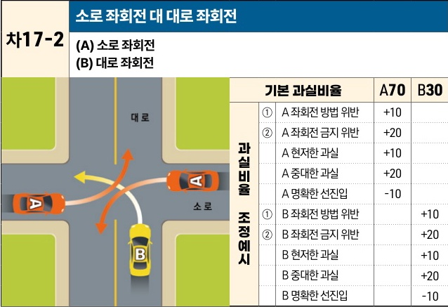

자동차사고 과실비율 인정기준 | 제3편 사고유형별 과실비율 적용기준 306 목차

## 차17-2 소로 좌회전 대 대로 좌회전
(A) 소로 좌회전
(B) 대로 좌회전

[The image shows a diagram of a T-junction intersection. Vehicle A is on a narrow road (소로) attempting to turn left onto a wide road (대로). Vehicle B is on the wide road (대로) attempting to turn left onto the narrow road (소로). Their paths intersect, leading to a potential collision.]

|           | 기본 과실비율       | A70 | B30 |
| --------- | ------------- | --- | --- |
| 과실비율 조정예시 | ① A 좌회전 방법 위반 | +10 |     |
|           | ② A 좌회전 금지 위반 | +20 |     |
|           | A 현저한 과실      | +10 |     |
|           | A 중대한 과실      | +20 |     |
|           | A 명확한 선진입     | -10 |     |
|           | ① B 좌회전 방법 위반 |     | +10 |
|           | ② B 좌회전 금지 위반 |     | +20 |
|           | B 현저한 과실      |     | +10 |
|           | B 중대한 과실      |     | +20 |
|           | B 명확한 선진입     |     | -10 |

※사고발생, 손해확대와의 인과관계를 감안하여 기본 과실비율을 가(+), 감(-) 조정 가능합니다.
※舊 235, 241-235CO1, 241-235CO2, 360, 361, 374-360CO, 374-361CO, 375-360CO, 375-361CO 기준

### 사고 상황
* 신호기에 의해 교통정리가 이루어지고 있지 않는 다른 폭의 교차로에서 소로를 이용하여 대로로 좌회전하는 A차량과 대로에서 소로로 좌회전하는 B차량이 충돌한 사고이다.

### 기본 과실비율 해설
* 양 차량 모두 좌회전하던 중의 사고이지만, 도로교통법 제26조 제2항에 따라 대로에서 진입한 B차량에게 통행우선권이 있으나 B차량도 동법 제25조 제2항 및 제31조에 따라 교차로 진입 전 서행 또는 일시정지를 준수하고 전방 및 좌우를 주의해야 하는 의무가 있어 양 차량의 기본 과실비율을 70:30으로 정한다.

### 수정요소(인과관계를 감안한 과실비율 조정) 해설
① 도로교통법 제25조 제2항에 따라 좌회전차량은 미리 도로의 중앙선을 따라 서행하면서 교차로의 중심 안쪽을 이용하여 좌회전하여야 하고, 동법 제38조 제1항에 따라 좌회전을 할 때에는 손이나 방향지시기 또는 등화로써 그 행위가 끝날 때까지 신호를 하여야 하므로,

제2장. 자동차와 자동차(이륜차 포함)의 사고
