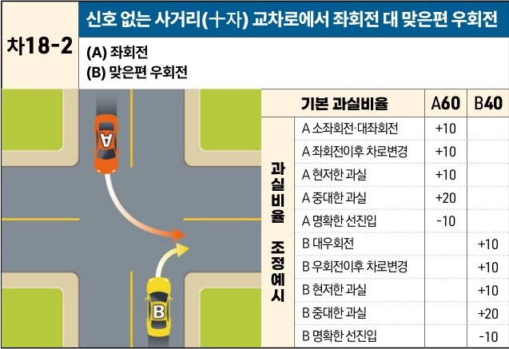

자동차사고 과실비율 인정기준 | 제3편 사고유형별 과실비율 적용기준 312

| 차18-2                                   | 신호 없는 사거리(十자) 교차로에서 좌회전 대 맞은편 우회전 |
| --------------------------------------- | --------------------------------- |
| \*\*(A) 좌회전\*\* \*\*(B) 맞은편 우회전\*\* |                                   |

[The image shows a diagram of a four-way intersection without traffic lights. Vehicle A (orange) is performing a left turn from the top road into the right road. Vehicle B (yellow) is performing a right turn from the bottom road into the same right road. Their paths intersect at the turn.]

| 과실비율 조정예시 | 기본 과실비율      | A60 | B40 |
| --------- | ------------ | --- | --- |
| 과실비율 조정예시 | A 소좌회전·대좌회전  | +10 |     |
|           | A 좌회전이후 차로변경 | +10 |     |
|           | A 현저한 과실     | +10 |     |
|           | A 중대한 과실     | +20 |     |
|           | A 명확한 선진입    | -10 |     |
| 과실비율 조정예시 | B 대우회전       |     | +10 |
|           | B 우회전이후 차로변경 |     | +10 |
|           | B 현저한 과실     |     | +10 |
|           | B 중대한 과실     |     | +20 |
|           | B 명확한 선진입    |     | -10 |

※사고발생, 손해확대와의 인과관계를 감안하여 기본 과실비율을 가(+), 감(-) 조정 가능합니다.

### 사고 상황
* 교통정리가 없는 사거리 교차로에서 좌회전하는 A차량과 맞은편에서 우회전하는 B차량이 충돌한 사고이다.

### 기본 과실비율 해설
* 도로교통법 제26조 제4항은 교통정리를 하고 있지 아니하는 교차로에서 좌회전하려는 차량은 그 교차로에서 우회전하려는 다른 차가 있을 때에는 그 차에 진로를 양보하여야 한다고 규정하여 우회전 차량에게 진행의 우선권을 인정하고 있다. 다만 우회전하는 차량도 교차로에서 진행하는 다른 차량에 주의하여 진행하여야 하는 점을 고려하여 양 차량의 기본과실을 60:40으로 정하였다.

### 수정요소(인과관계를 감안한 과실비율 조정) 해설
* 대좌회전·대우회전은 교차로통행방법을 위반하고 사고위험을 가중하는 행위이므로 이를 위반한 차량의 과실을 가산할 수 있다.

제2장. 자동차와 자동차(이륜차 포함)의 사고
