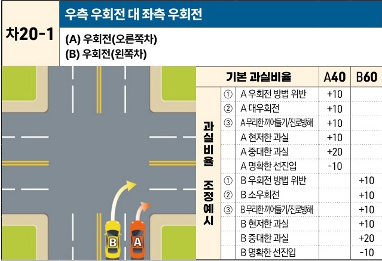

자동차사고 과실비율 인정기준 | 제3편 사고유형별 과실비율 적용기준 317

## 2) 동시 우회전 사고 [차20]

| 차20-1 | 우측 우회전 대 좌측 우회전 (A) 우회전(오른쪽차)(B) 우회전(왼쪽차) | 우측 우회전 대 좌측 우회전 (A) 우회전(오른쪽차)(B) 우회전(왼쪽차) | 우측 우회전 대 좌측 우회전 (A) 우회전(오른쪽차)(B) 우회전(왼쪽차) | 우측 우회전 대 좌측 우회전 (A) 우회전(오른쪽차)(B) 우회전(왼쪽차) | 우측 우회전 대 좌측 우회전 (A) 우회전(오른쪽차)(B) 우회전(왼쪽차) |
| ----- | --------------------------------------------- | --------------------------------------------- | --------------------------------------------- | --------------------------------------------- | --------------------------------------------- |
|       | 기본 과실비율                                       |                                               | A40                                           | B60                                           |                                               |
|       | 과실비율 조정예시                                     | ①                                             | A 우회전 방법 위반                                   | +10                                           |                                               |
|       |                                               | ②                                             | A 대우회전                                        | +10                                           |                                               |
|       |                                               | ③                                             | A 무리한 끼어들기/진로방해                               | +10                                           |                                               |
|       |                                               | A 현저한 과실                                      | +10                                           |                                               |                                               |
|       |                                               | A 중대한 과실                                      | +20                                           |                                               |                                               |
|       |                                               | A 명확한 선진입                                     | -10                                           |                                               |                                               |
|       |                                               | ①                                             | B 우회전 방법 위반                                   |                                               | +10                                           |
|       |                                               | ②                                             | B 소우회전                                        |                                               | +10                                           |
|       |                                               | ③                                             | B 무리한 끼어들기/진로방해                               |                                               | +10                                           |
|       |                                               | B 현저한 과실                                      |                                               | +10                                           |                                               |
|       |                                               | B 중대한 과실                                      |                                               | +20                                           |                                               |
|       |                                               | B 명확한 선진입                                     |                                               | -10                                           |                                               |

※사고발생, 손해확대와의 인과관계를 감안하여 기본 과실비율을 가(+), 감(-) 조정 가능합니다.
※舊 247(가) 기준

### 사고 상황
* 양 차량이 교차로에서 동일방향으로 동시 또는 유사한 시각에 진행함에 있어, 크게 또는 작게 우회전을 하다가 오른쪽에서 진행하는 A차량과 왼쪽에서 진행하는 B차량이 충돌한 사고이다.

### 기본 과실비율 해설
* 동시 우회전 중 사고인 경우에는 도로교통법 제14조 제2항(차로 따라 통행), 제25조 제1항(도로의 오른쪽 가장자리 서행 우회전) 등에 따라 오른쪽 가장자리로 우회전하는 A차량의 과실을 작게 보아 양 차량의 기본 과실비율을 40:60으로 정하였다.

### 수정요소(인과관계를 감안한 과실비율 조정) 해설
① 우회전을 하려는 경우에는 도로교통법 제25조 제1항에 따라 미리 도로의 오른쪽 가장자리를 따라 서행하여야 하고, 도로교통법 제38조 제1항에 따라 손이나 방향지시기 또는

제2장. 자동차와 자동차(이륜차 포함)의 사고
