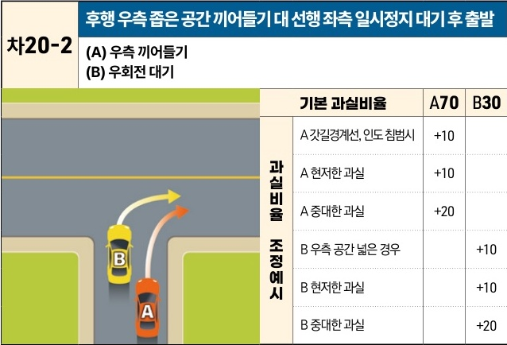

자동차사고 과실비율 인정기준 | 제3편 사고유형별 과실비율 적용기준 320

# 차20-2 후행 우측 좁은 공간 끼어들기 대 선행 좌측 일시정지 대기 후 출발
**(A) 우측 끼어들기**
**(B) 우회전 대기**

[The image shows a diagram of a road intersection. Vehicle B is positioned in the center of a single lane, waiting to turn right. Vehicle A is a following vehicle that has squeezed into the narrow space on the right side of Vehicle B to attempt a right turn. Arrows indicate both vehicles' intended right-turn paths.]

| 과실비율 조정예시 | 과실비율 조정예시       | 기본 과실비율 | A70 | B30 |
| --------- | --------------- | ------- | --- | --- |
| 과실비율 조정예시 | A 갓길경계선, 인도 침범시 | +10     |     |     |
|           | A 현저한 과실        | +10     |     |     |
|           | A 중대한 과실        | +20     |     |     |
| 과실비율 조정예시 | B 우측 공간 넓은 경우   |         | +10 |     |
|           | B 현저한 과실        |         | +10 |     |
|           | B 중대한 과실        |         | +20 |     |

※사고발생, 손해확대와의 인과관계를 감안하여 기본 과실비율을 가(+), 감(-) 조정 가능합니다.

### 사고 상황
* 선행 B차량이 우회전 대기 중인 상태에서 후행 A차량이 우측 공간으로 끼어들기하여 우회전(대기)하다가 선행 B차량이 우회전하면서 접촉한 사고이다(우측 공간이 좁은 경우).

### 기본 과실비율 해설
* 도로교통법 제14조 제2항(차로 따라 통행), 제25조 제1항(도로의 우측 가장자리 서행), 제25조 제4항(우회전신호 선행차량 진행 방해 금지), 제26조 제1항(선진입차량에 양보)에 따라 차량이 단일차로에서 선·후행으로 진행하다가 후행 A차량이 먼저 빠져나가기 위해 우측으로 끼어들기 하여 우회전하던 중 접촉한 경우(선·후관계, 끼어들기 유사 사고), 후방에서 우측으로 끼어들기한 A차량의 과실이 더 많은 것으로 판단하여, 선행 위치에서 우회전한 B차량 30%, 후행 위치에서 끼어들기하면서 우회전한 A차량 70%로 기본과실을 정하였다.

제2장. 자동차와 자동차(이륜차 포함)의 사고
