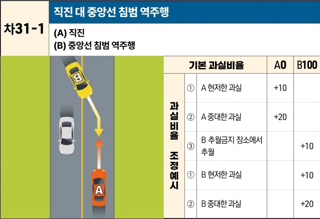

자동차사고 과실비율 인정기준 | 제3편 사고유형별 과실비율 적용기준 327 **목차**

## 나. 마주보는 방향 진행차량 상호 간의 사고
### (1) 중앙선 침범 사고 [차31]

| 차31-1 차31-1 | 직진 대 중앙선 침범 역주행 (A) 직진(B) 중앙선 침범 역주행 A차량(직진)과 B차량(중앙선 침범)의 충돌 상황도 | 직진 대 중앙선 침범 역주행 (A) 직진(B) 중앙선 침범 역주행 기본 과실비율 과실비율 조정예시 | 직진 대 중앙선 침범 역주행 (A) 직진(B) 중앙선 침범 역주행 기본 과실비율 ① A 현저한 과실 ② A 중대한 과실 ③ B 추월금지 장소에서 추월 ① B 현저한 과실 ② B 중대한 과실 | 직진 대 중앙선 침범 역주행 (A) 직진(B) 중앙선 침범 역주행 A0 +10 +20 | 직진 대 중앙선 침범 역주행 (A) 직진(B) 중앙선 침범 역주행 B100+10 +10 +20 |
| --------------- | ------------------------------------------------------------------------- | ------------------------------------------------------------------ | ------------------------------------------------------------------------------------------------------------------------------------- | --------------------------------------------------------------- | -------------------------------------------------------------------- |

※사고발생, 손해확대와의 인과관계를 감안하여 기본 과실비율을 가(+), 감(-) 조정 가능합니다.
※舊 249, 382, 383 기준

#### 사고 상황
* 중앙선이 설치되어 있는 도로에서 직진하는 A차량과 맞은편 주행방향에서 진행하다가 중앙선을 침범하여 역주행하는 B차량이 충돌한 사고이다.

#### 기본 과실비율 해설
* 맞은편 주행방향에서 직진하던 B차량이 중앙선을 침범하여 정상 직진 중인 A차량을 충돌한 사고로서, A차량에게는 사고에 관한 예측가능성과 회피가능성이 없으므로 중앙선 침범 차량인 B차량의 일방과실로 보아 양 차량의 비율을 0:100으로 정하였다.

제2장. 자동차와 자동차(이륜차 포함)의 사고
