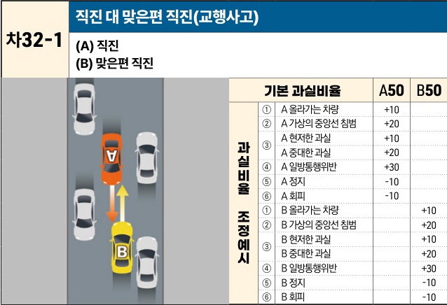

자동차사고 과실비율 인정기준 | 제3편 사고유형별 과실비율 적용기준 339 목차

## (2) 중앙선 없거나 중앙선침범 미적용 도로에서 교행 사고 [차32]

| 차32-1                                           | 직진 대 맞은편 직진(교행사고) (A) 직진(B) 맞은편 직진 | 직진 대 맞은편 직진(교행사고) (A) 직진(B) 맞은편 직진 | 직진 대 맞은편 직진(교행사고) (A) 직진(B) 맞은편 직진 | 직진 대 맞은편 직진(교행사고) (A) 직진(B) 맞은편 직진 | 직진 대 맞은편 직진(교행사고) (A) 직진(B) 맞은편 직진 |
| ----------------------------------------------- | -------------------------------------- | -------------------------------------- | -------------------------------------- | -------------------------------------- | -------------------------------------- |
| A차량(주황색)과 B차량(노란색)이 좁은 도로에서 마주 보고 주행하다 충돌하는 상황도 | 기본 과실비율                                | A50                                    | B50                                    |                                        |                                        |
|                                                 | 과실비율 조정예시                              | ① A 올라가는 차량                            | +10                                    |                                        |                                        |
|                                                 |                                        | ② A 가상의 중앙선 침범                         | +20                                    |                                        |                                        |
|                                                 |                                        | ③                                      | A 현저한 과실 A 중대한 과실                  | +10                                    |                                        |
|                                                 |                                        | +20                                    |                                        |                                        |                                        |
|                                                 |                                        | ④ A 일방통행위반                             | +30                                    |                                        |                                        |
|                                                 |                                        | ⑤ A 정지                                 | -10                                    |                                        |                                        |
|                                                 |                                        | ⑥ A 회피                                 | -10                                    |                                        |                                        |
|                                                 |                                        | ① B 올라가는 차량                            |                                        | +10                                    |                                        |
|                                                 |                                        | ② B 가상의 중앙선 침범                         |                                        | +20                                    |                                        |
|                                                 |                                        | ③                                      | B 현저한 과실 B 중대한 과실                  |                                        | +10                                    |
|                                                 |                                        |                                        |                                        | +20                                    |                                        |
|                                                 |                                        | ④ B 일방통행위반                             |                                        | +30                                    |                                        |
|                                                 |                                        | ⑤ B 정지                                 |                                        | -10                                    |                                        |
|                                                 |                                        | ⑥ B 회피                                 |                                        | -10                                    |                                        |

※사고발생, 손해확대와의 인과관계를 감안하여 기본 과실비율을 가(+), 감(-) 조정 가능합니다.
※舊 249-1 기준

### 사고 상황
* 도로에 중앙선이 설치되어 있지 않고 좁은 도로폭 등으로 인해 양 차량이 계속 주행하기 위해 부득이 가상의 중앙선을 넘어가야 하는 골목길 또는 이면도로에서 서로 마주오던 A차량과 B차량이 교행하다가 충돌한 사고 이다.

### 기본 과실비율 해설
* 좁은 도로 폭이나 도로 양쪽의 주차차량들로 인해 양 차량의 교행이 쉽지 않은 이면도로에서는 양 차량 모두 가상의 중앙선을 넘나들면서 주행하는 경우가 많고, 통상의 차량운전자라면 이러한 사정을 충분히 예상하면서 미리 교행이 원활한 지점에서 양보하는 등 교행에 대비하여 운전해야 하므로 양 차량 모두 양보운전의무를 위반한 과실은 동일하다는 점을 고려하여 양 차량의 기본 과실비율을 50:50으로 정한다.

제2장. 자동차와 자동차(이륜차 포함)의 사고
