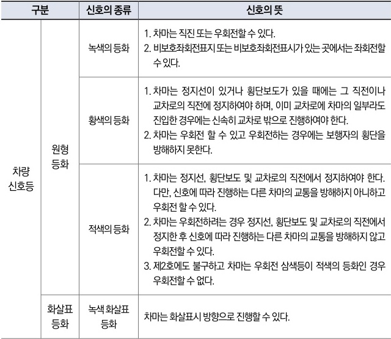
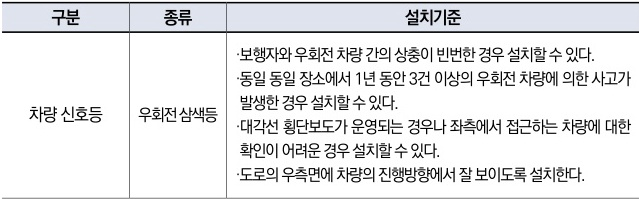

자동차사고 과실비율 인정기준 | 제3편 사고유형별 과실비율 적용기준 350

### ◉ 도로교통법 시행규칙 별표2(신호기가 표시하는 신호의 종류 및 신호의 뜻)

| 구분     | 신호의 종류 | 신호의 뜻  |                                                                         |                                                                                                                                                            |                                                                                                                                                                                                                                         |
| ------ | ------ | ------ | ----------------------------------------------------------------------- | ---------------------------------------------------------------------------------------------------------------------------------------------------------- | --------------------------------------------------------------------------------------------------------------------------------------------------------------------------------------------------------------------------------------- |
| 차량 신호등 | 원형 등화  | 녹색의 등화 | 1. 차마는 직진 또는 우회전할 수 있다. 2. 비보호좌회전표지 또는 비보호좌회전표시가 있는 곳에서는 좌회전할 수 있다. |                                                                                                                                                            |                                                                                                                                                                                                                                         |
| 차량 신호등 |        | 원형 등화  | 황색의 등화                                                                  | 1. 차마는 정지선이 있거나 횡단보도가 있을 때에는 그 직전이나 교차로의 직전에 정지하여야 하며, 이미 교차로에 차마의 일부라도 진입한 경우에는 신속히 교차로 밖으로 진행하여야 한다. 2. 차마는 우회전 할 수 있고 우회전하는 경우에는 보행자의 횡단을 방해하지 못한다. |                                                                                                                                                                                                                                         |
| 차량 신호등 |        |        | 원형 등화                                                                   | 적색의 등화                                                                                                                                                     | 1. 차마는 정지선, 횡단보도 및 교차로의 직전에서 정지하여야 한다. 다만, 신호에 따라 진행하는 다른 차마의 교통을 방해하지 아니하고 우회전 할 수 있다. 2. 차마는 우회전하려는 경우 정지선, 횡단보도 및 교차로의 직전에서 정지한 후 신호에 따라 진행하는 다른 차마의 교통을 방해하지 않고 우회전할 수 있다. 3. 제2호에도 불구하고 차마는 우회전 삼색등이 적색의 등화인 경우 우회전할 수 없다. |
| 차량 신호등 | 화살표 등화 |        |                                                                         | 녹색 화살표 등화                                                                                                                                                  | 차마는 화살표시 방향으로 진행할 수 있다.                                                                                                                                                                                                                 |

### ◉ 도로교통법 시행규칙 별표3(신호등의 종류, 만드는 방식 및 설치기준)

| 구분     | 종류      | 설치기준                                                                                                                                                                                               |
| ------ | ------- | -------------------------------------------------------------------------------------------------------------------------------------------------------------------------------------------------- |
| 차량 신호등 | 우회전 삼색등 | ·보행자와 우회전 차량 간의 상충이 빈번한 경우 설치할 수 있다. ·동일 장소에서 1년 동안 3건 이상의 우회전 차량에 의한 사고가 발생한 경우 설치할 수 있다. ·대각선 횡단보도가 운영되는 경우나 좌측에서 접근하는 차량에 대한 확인이 어려운 경우 설치할 수 있다. ·도로의 우측면에 차량의 진행방향에서 잘 보이도록 설치한다. |

#### <mark>참고 판례</mark>

**◉ 서울남부지방법원 2018. 8. 16. 선고 2017나66389 판결**
B차량은 신호에 따라 유턴을 거의 완료하였고, A차량의 왼쪽 앞부분과 B차량의 오른쪽 뒷부분이 충돌한 사고, B과실 0%.

제2장. 자동차와 자동차(이륜차 포함)의 사고
