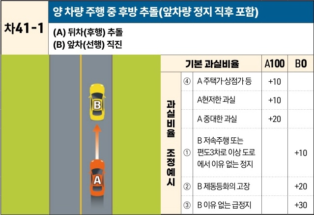

자동차사고 과실비율 인정기준 | 제3편 사고유형별 과실비율 적용기준 351

## 다. 같은 방향 진행차량 상호 간의 사고
### (1) 안전거리미확보로 인한 추돌사고 [차41]

| 차41-1 | 양 차량 주행 중 후방 추돌(앞차량 정지 직후 포함) (A) 뒤차(후행) 추돌(B) 앞차(선행) 직진 A차량(주황색)이 B차량(노란색)의 후방을 추돌하는 상황도 | 양 차량 주행 중 후방 추돌(앞차량 정지 직후 포함) (A) 뒤차(후행) 추돌(B) 앞차(선행) 직진 기본 과실비율 과실비율 조정예시 | 양 차량 주행 중 후방 추돌(앞차량 정지 직후 포함) (A) 뒤차(후행) 추돌(B) 앞차(선행) 직진 기본 과실비율 ④ A 주택가·상점가 등 A 현저한 과실 A 중대한 과실 ① B 저속주행 또는 편도3차로 이상 도로에서 이유 없는 정지 ② B 제동등화의 고장 ③ B 이유 없는 급정지 | 양 차량 주행 중 후방 추돌(앞차량 정지 직후 포함) (A) 뒤차(후행) 추돌(B) 앞차(선행) 직진 A100 +10 +10 +20 | 양 차량 주행 중 후방 추돌(앞차량 정지 직후 포함) (A) 뒤차(후행) 추돌(B) 앞차(선행) 직진 B0+10 +20 +30 |
| ----- | ------------------------------------------------------------------------------------------------- | -------------------------------------------------------------------------------------- | ---------------------------------------------------------------------------------------------------------------------------------------------------------------------------------------------- | --------------------------------------------------------------------------------------------- | -------------------------------------------------------------------------------------- |

※사고발생, 손해확대와의 인과관계를 감안하여 기본 과실비율을 가(+), 감(-) 조정 가능합니다.
※舊 253, 390, 391, 507 기준

#### 사고 상황
* 도로(고속도로 및 자동차전용도로 포함)를 후행하여 진행하는 A차량(뒤차)이 동일방향에서 선행하는 B차량(앞차)을 추돌한 사고이다.

#### 기본 과실비율 해설
* 추돌사고의 경우 기본적으로 선행차량인 피추돌차량은 과실이 없고, 추돌차량의 전방주시 태만 및 안전거리 미확보로 인하여 발생하므로 추돌차량의 일방과실로 보아 양 차량의 기본 과실비율을 100:0으로 정하였다.

제2장. 자동차와 자동차(이륜차 포함)의 사고
