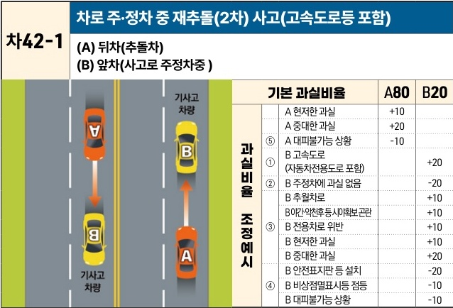

자동차사고 과실비율 인정기준 | 제3편 사고유형별 과실비율 적용기준 355 목차

# (2) 주정차 차량 추돌사고 [차42]

| 차42-1                                                                                                                                                                                                                                                            | 차로 주·정차 중 재추돌(2차) 사고(고속도로등 포함) (A) 뒤차(추돌차)(B) 앞차(사고로 주정차중) | 차로 주·정차 중 재추돌(2차) 사고(고속도로등 포함) (A) 뒤차(추돌차)(B) 앞차(사고로 주정차중) | 차로 주·정차 중 재추돌(2차) 사고(고속도로등 포함) (A) 뒤차(추돌차)(B) 앞차(사고로 주정차중) | 차로 주·정차 중 재추돌(2차) 사고(고속도로등 포함) (A) 뒤차(추돌차)(B) 앞차(사고로 주정차중) |
| ---------------------------------------------------------------------------------------------------------------------------------------------------------------------------------------------------------------------------------------------------------------- | -------------------------------------------------------------- | -------------------------------------------------------------- | -------------------------------------------------------------- | -------------------------------------------------------------- |
| \[The image shows a diagram of a multi-lane road. In the left lane, two cars (labeled "기사고 차량") are involved in a previous accident. In the right lane, car B is stopped due to the accident ahead, and car A is approaching from behind to collide with car B.] | 기본 과실비율 \[thead] A80 \[thead] B20                              |                                                                |                                                                |                                                                |
|                                                                                                                                                                                                                                                                  | 과실비율 조정예시 ⑤ A 현저한 과실 +10                                       |                                                                |                                                                |                                                                |
|                                                                                                                                                                                                                                                                  |                                                                | ⑤ A 중대한 과실 +20                                                 |                                                                |                                                                |
|                                                                                                                                                                                                                                                                  |                                                                | ⑤ A 대피불가능 상황 -10                                               |                                                                |                                                                |
|                                                                                                                                                                                                                                                                  |                                                                | ① B 고속도로 (자동차전용도로 포함) +20                                  |                                                                |                                                                |
|                                                                                                                                                                                                                                                                  |                                                                | ② B 주정차에 과실 없음 -20                                             |                                                                |                                                                |
|                                                                                                                                                                                                                                                                  |                                                                | ③ B 추월차로 +10                                                   |                                                                |                                                                |
|                                                                                                                                                                                                                                                                  |                                                                | ③ B 야간·악천후 등 시야확보 곤란 +10                                       |                                                                |                                                                |
|                                                                                                                                                                                                                                                                  |                                                                | ③ B 전용차로 위반 +10                                                |                                                                |                                                                |
|                                                                                                                                                                                                                                                                  |                                                                | ③ B 현저한 과실 +10                                                 |                                                                |                                                                |
|                                                                                                                                                                                                                                                                  |                                                                | ③ B 중대한 과실 +20                                                 |                                                                |                                                                |
|                                                                                                                                                                                                                                                                  |                                                                | ④ B 안전표지판 등 설치 -20                                             |                                                                |                                                                |
|                                                                                                                                                                                                                                                                  |                                                                | ④ B 비상점멸표시등 점등 -10                                             |                                                                |                                                                |
|                                                                                                                                                                                                                                                                  |                                                                | ④ B 대피불가능 상황 -10                                               |                                                                |                                                                |

※사고발생, 손해확대와의 인과관계를 감안하여 기본 과실비율을 가(+), 감(-) 조정 가능합니다.
※舊 245, 505 기준

### 사고 상황
* 일반 도로 및 고속도로(자동차전용도로 포함)에서 A차량이 진행 중 전방에서 선행사고 후 사고처리가 완료되지 않아 도로상에 주·정차하고 있는 B차량을 추돌한 사고이다.

### 기본 과실비율 해설
* 일반 도로에서의 추돌사고는 추돌한 차량의 전방주시의무 위반과 안전거리 미확보(도로교통법 제19조 제1항)로 인하여 발생하는 것이 일반적이므로 뒤에서 추돌한 A(추돌차)와 앞에서 추돌을 당한 B(피추돌차)의 기본 과실비율을 80:20으로 정한다.

### 수정요소(인과관계를 감안한 과실비율 조정) 해설
* 수정요소는 아래 ① 내지 ④를 거쳐서 B의 과실이 인정되어 A의 비율이 100미만이 될 경우에 한하여 A의 과실 사유를 가산한 뒤 최종 비율을 확정한다. 유의할 점은 ② 또는 ③

제2장. 자동차와 자동차(이륜차 포함)의 사고
