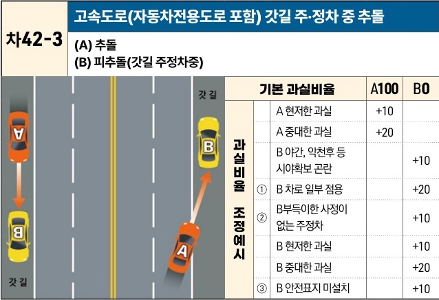

자동차사고 과실비율 인정기준 | 제3편 사고유형별 과실비율 적용기준 365

| 차42-3                                         | 고속도로(자동차전용도로 포함) 갓길 주·정차 중 추돌 |      |     |
| --------------------------------------------- | ----------------------------- | ---- | --- |
| (이미지 설명: 고속도로 갓길에 주차된 B차량을 주행하던 A차량이 추돌하는 상황) | (A) 추돌 (B) 피추돌(갓길 주정차중)   |      |     |
| 과실비율 조정예시                                     | 기본 과실비율                       | A100 | B0  |
|                                               | A 현저한 과실                      | +10  |     |
|                                               | A 중대한 과실                      | +20  |     |
|                                               | B 야간, 악천후 등 시야확보 곤란           |      | +10 |
| ①                                             | B 차로 일부 점용                    |      | +20 |
| ②                                             | B 부득이한 사정이 없는 주정차             |      | +10 |
|                                               | B 현저한 과실                      |      | +10 |
|                                               | B 중대한 과실                      |      | +20 |
| ③                                             | B 안전표지 미설치                    |      | +10 |

※사고발생, 손해확대와의 인과관계를 감안하여 기본 과실비율을 가(+), 감(-) 조정 가능합니다.
※舊 506 기준

### 사고 상황
* 고속도로(자동차전용도로 포함) 등에서 갓길에 주(정)차인 B차량을 동일방향에서 후행하여 주행하는 A차량이 추돌한 사고이다.

### 기본 과실비율 해설
* 도로교통법 제60조 제1항에 따라 자동차의 고장 등 부득이한 사유가 있는 경우에만 갓길을 통행할 수 있으므로 갓길에 정차한 차량이 위와 같은 부득이한 사정이 있는 경우를 B차량 측이 입증했음을 전제로 피추돌차량이 사고에 관한 예견 및 회피가능성을 인정하기 어려우므로 추돌차량인 A차량의 일방과실로 보아 양 차량의 기본 과실비율을 100:0으로 정한다.

### 수정요소(인과관계를 감안한 과실비율 조정) 해설
* B의 수정요소를 먼저 가산하고 A의 비율이 100미만이 될 경우에 한하여 A의 과실을 가산하여 최종 비율을 확정한다.

제2장. 자동차와 자동차(이륜차 포함)의 사고
