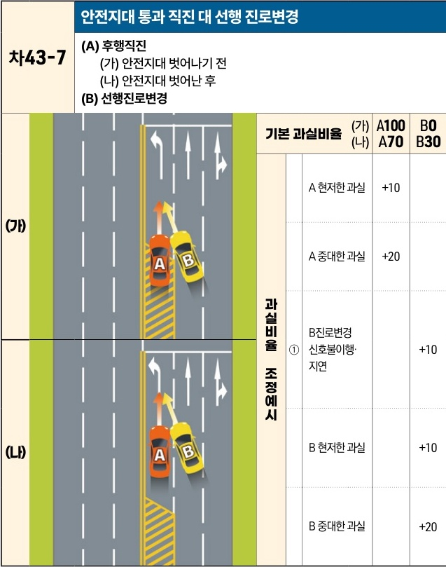

자동차사고 과실비율 인정기준 | 제3편 사고유형별 과실비율 적용기준 388 목차

## 차43-7 안전지대 통과 직진 대 선행 진로변경
**(A) 후행직진**
(가) 안전지대 벗어나기 전
(나) 안전지대 벗어난 후
**(B) 선행진로변경**

|     | 기본 과실비율   | 기본 과실비율          | 기본 과실비율 | 기본 과실비율 | (가) A100 (나) A70 | B0 B30 | B0 B30 | B0 B30 | B0 B30 |
| --- | --------- | ---------------- | ------- | ------- | -------------------- | ---------- | ---------- | ---------- | ---------- |
| (가) | 과실비율 조정예시 | A 현저한 과실         |         | +10     |                      |            |            |            |            |
|     |           | A 중대한 과실         |         | +20     |                      |            |            |            |            |
|     |           | B진로변경 ① 신호불이행·지연 |         | +10     |                      |            |            |            |            |
|     |           |                  |         |         | (나)                  | B 현저한 과실   |            |            | +10        |
|     |           | B 중대한 과실         |         |         | +20                  |            |            |            |            |

※사고발생, 손해확대와의 인과관계를 감안하여 기본 과실비율을 가(+), 감(-) 조정 가능합니다.
※舊 252-4, 388-2, 389-2 기준

제2장. 자동차와 자동차(이륜차 포함)의 사고
