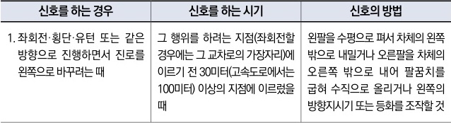

자동차사고 과실비율 인정기준 | 제3편 사고유형별 과실비율 적용기준 395

우측으로 통행할 수 있다. 이 경우 자전거의 운전자는 정지한 차에서 승차하거나 하차하는 사람의 안전에 유의하여 서행하거나 필요한 경우 일시정지하여야 한다.
③ 제1항과 제2항의 경우 앞지르려고 하는 모든 차의 운전자는 반대방향의 교통과 앞차 앞쪽의 교통에도 주의를 충분히 기울여야 하며, 앞차의 속도·진로와 그 밖의 도로상황에 따라 방향지시기·등화 또는 경음기(警音機)를 사용하는 등 안전한 속도와 방법으로 앞지르기를 하여야 한다.
④ 모든 차의 운전자는 제1항부터 제3항까지 또는 제60조제2항에 따른 방법으로 앞지르기를 하는 차가 있을 때에는 속도를 높여 경쟁하거나 그 차의 앞을 가로막는 등의 방법으로 앞지르기를 방해하여서는 아니 된다.

**◉ 도로교통법 제22조(앞지르기 금지의 시기 및 장소)**
③ 모든 차의 운전자는 다음 각 호의 어느 하나에 해당하는 곳에서는 다른 차를 앞지르지 못한다.
1. 교차로

**◉ 도로교통법 제25조(교차로 통행방법)**
② 모든 차의 운전자는 교차로에서 좌회전을 하려는 경우에는 미리 도로의 중앙선을 따라서 행하면서 교차로의 중심 안쪽을 이용하여 좌회전하여야 한다. 다만, 시·도 경찰청장이 교차로의 상황에 따라 특히 필요하다고 인정하여 지정한 곳에서는 교차로의 중심 바깥쪽을 통과할 수 있다.

**◉ 도로교통법 제38조(차의 신호)**
① 모든 차의 운전자는 좌회전·우회전·횡단·유턴·서행·정지 또는 후진을 하거나 같은 방향으로 진행하면서 진로를 바꾸려고 하는 경우와 회전교차로에 진입하거나 회전교차로에서 진출하는 경우에는 손이나 방향지시기 또는 등화로써 그 행위가 끝날 때까지 신호를 하여야 한다.

**◉ 도로교통법 시행령 별표 2(신호의 시기 및 방법 [제21조 관련])**

| 신호를 하는 경우                                     | 신호를 하는 시기                                                                     | 신호의 방법                                                                                   |
| --------------------------------------------- | ----------------------------------------------------------------------------- | ---------------------------------------------------------------------------------------- |
| 1. 좌회전·횡단·유턴 또는 같은 방향으로 진행하면서 진로를 왼쪽으로 바꾸려는 때 | 그 행위를 하려는 지점(좌회전할 경우에는 그 교차로의 가장자리)에 이르기 전 30미터(고속도로에서는 100미터) 이상의 지점에 이르렀을 때 | 왼팔을 수평으로 펴서 차체의 왼쪽 밖으로 내밀거나 오른팔을 차체의 오른쪽 밖으로 내어 팔꿈치를 굽혀 수직으로 올리거나 왼쪽의 방향지시기 또는 등화를 조작할 것 |

제2장. 자동차와 자동차(이륜차 포함)의 사고
