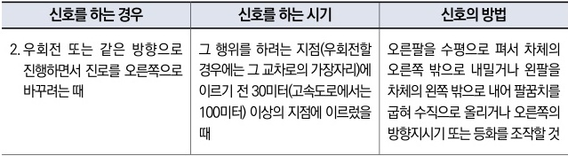

자동차사고 과실비율 인정기준 | 제3편 사고유형별 과실비율 적용기준 396

| 신호를 하는 경우                                | 신호를 하는 시기                                                                     | 신호의 방법                                                                                    |
| ---------------------------------------- | ----------------------------------------------------------------------------- | ----------------------------------------------------------------------------------------- |
| 2. 우회전 또는 같은 방향으로 진행하면서 진로를 오른쪽으로 바꾸려는 때 | 그 행위를 하려는 지점(우회전할 경우에는 그 교차로의 가장자리)에 이르기 전 30미터(고속도로에서는 100미터) 이상의 지점에 이르렀을 때 | 오른팔을 수평으로 펴서 차체의 오른쪽 밖으로 내밀거나 왼팔을 차체의 왼쪽 밖으로 내어 팔꿈치를 굽혀 수직으로 올리거나 오른쪽의 방향지시기 또는 등화를 조작할 것 |

### <u>참고 판례</u>

**⊙ 서울중앙지방법원 2016.10.21. 선고 2016나36026 판결**
진행도로가 좌측으로 굽어지는 편도 1차로 교차로에서 피고는 중앙선을 침범하여 원고를 추월하다가 사고가 발생, 앞지르기 위반에 대한 피고의 과실이 매우 크나 원고도 도로형태를 고려 좌회전 하기 전 사이드미러를 통해 주변을 살펴야 하는 점을 소홀히 함, 원고 90% : 피고 10%

**⊙ 인천지방법원 부천지원 2011가단20340(본소), 2011가단39283(반소) 판결**
삼거리 교차로에서 원고 차량이 편도 1차로 도로에서 좌회전하던 중 원고 차량에 후행하던 피고 이륜차가 중앙선을 침범한 채 추월진행하다가 원고 차량과 충돌한 사고에 대하여, 이 사건 사고는 피고 이륜차가 무리하게 중앙선을 넘어 원고 차량을 추월하려고 한 일방적인 과실에 의하여 발생하였다고 할 것이고, 신호등이 없는 'ㅓ'자형 교차로에서 좌회전하던 원고 차량으로서는 뒤에서 진행하던 오토바이가 중앙선을 넘어 원고 차량을 추월하려고 할 경우까지 예상하면서 운전하여야 할 주의의무가 있다고 볼 수 없다고 보아 피고 이륜차의 일방 과실에 기한 사고로 판단함. 원고 차량 과실 0%, 피고 이륜차 과실 100%.

제2장. 자동차와 자동차(이륜차 포함)의 사고
